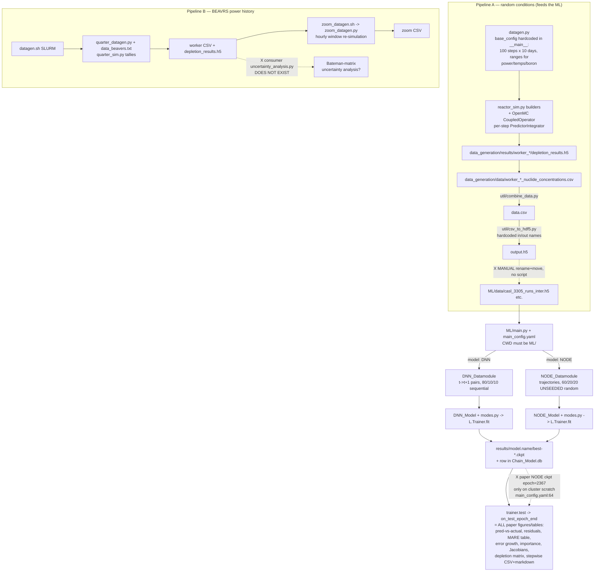
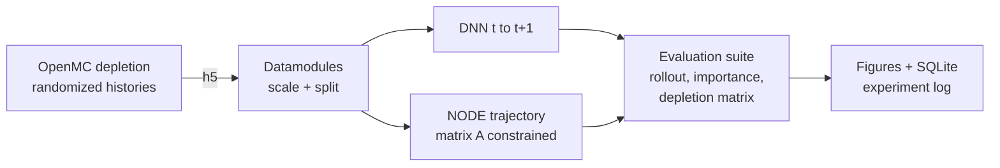

# AUDIT — Pass 1: Repo Map, Data Flow, Entry Points, Dead Code, Open Questions

**Scope of this pass:** build an accurate mental model of the repo before recommending
anything. Every claim below was verified by reading the files; line numbers are cited.
Findings are recorded, not yet fixed. Pass 2 (recommendations + prioritized plan) starts
after the five questions at the end are answered.

**Repo vitals:** Sept 2025 → Aug 2026, two authors, ~50 tracked files, ~6,600 lines of
Python. Paper claim: DNN and NODE surrogates for depletion calculations retain physics
seen in Monte Carlo (OpenMC) simulations. Two target audiences: (a) referees/physicists
reproducing results, (b) hiring managers skimming for 5 minutes.

---

## 1. Repo map

```
Nuclear_Transport_With_ML/
├── README.md                    — install guide. STALE: references external/openmc
│                                  submodule that isn't in the tree (no .gitmodules);
│                                  says `python test/test.py` but dir is tests/
├── environment.yml              — conda env: openmc, pytorch, lightning, torchdiffeq, optuna…
├── pyproject.toml               — packages only ML/ (`pip install -e .`)
├── datagen.sh                   — SLURM wrapper → quarter_datagen.py (BEAVRS pipeline)
├── zoom_datagen.sh              — SLURM wrapper → zoom_datagen.py (hourly zoom window)
├── neural_ode_lokta_volterra.py — ❓ UNTRACKED 847-line "thesis-quality plots" rework of
│                                  ML/playground/neural_ode_lokta_volterra.py; produced the
│                                  stray Lotka-Volterra figures in results/
├── Chain_Model.db               — SQLite experiment log (untracked; a SECOND copy in ML/)
├── data/                        — OpenMC nuclear data (untracked): cross_sections.xml,
│                                  chain_casl_pwr.xml, chain_endfb71_pwr.xml, simple_chain.xml,
│                                  neutron/ photon/ wmp/
│
├── data_generation/
│   ├── datagen.py               — ENTRY, Pipeline A: random-conditions pin-cell depletion,
│   │                              100 steps × 10 days = 1000 days (base_config lines 270-289)
│   ├── reactor_sim.py           — OpenMC builders for datagen.py (materials/geometry/settings)
│   ├── quarter_datagen.py       — ENTRY, Pipeline B: BEAVRS cycle-1 power-history depletion
│   │                              with capture/fission tallies, checkpoint/resume
│   ├── quarter_sim.py           — OpenMC builders + tally lists for quarter_datagen
│   ├── zoom_datagen.py          — ENTRY, Pipeline B: re-simulate [start-day, end-day] at fine
│   │                              dt from a daily depletion_results.h5
│   ├── data_beavers.txt         — BEAVRS power history (day, % rated power), 526 rows
│   └── data/, results/          — worker outputs; EMPTY on this machine
│
├── ML/                          (the installable package; canonical CWD for main.py)
│   ├── main.py                  — ENTRY: dispatch on main_config.yaml → train / train_from_ckp
│   │                              / inference for DNN or NODE. Loads config via relative path
│   │                              (main.py:15) → must run with CWD=ML/
│   ├── main_config.yaml         — the single config: data paths, features+scalers, model
│   │                              architecture, matrix constraints, training, runtime
│   ├── HowToUse.md              — config docs. DNN-era only; all NODE keys undocumented;
│   │                              seed claim (lines 128-130) contradicts code (see §4)
│   ├── gpu_job_runner.py        — ENTRY: writes + interactively submits SLURM GPU job for main.py
│   ├── datamodule/
│   │   ├── dataset_helper.py    — h5/csv read, run-length detection, (t→t+1) pair building,
│   │   │                          sequential split, scaling, tensor datasets
│   │   ├── data_scalers.py      — scaler registry, per-column ColumnTransformer, inverse
│   │   ├── dnn_datamodule.py    — (state_t → state_t+1) pairs for DNN; 80/10/10 sequential split
│   │   └── neural_ode_datamodule.py — full trajectories for NODE; 60/20/20 RANDOM split;
│   │                              separate inference mode (scalers from train file)
│   ├── models/
│   │   ├── model_architectures.py — Deep_Neural_Network (MLP); ODEFuncForced (black-box NODE);
│   │   │                          ODEFuncMatrix (constrained depletion matrix dy/dt = A(u,y)·y)
│   │   ├── dnn_model.py         — 633 lines: DNN LightningModule + ALL DNN evaluation/plots
│   │   ├── neural_ode.py        — 1,366 lines: NODE LightningModule + ALL NODE evaluation:
│   │   │                          Jacobian analysis, stepwise importance, depletion-matrix plots
│   │   ├── model_helper.py      — activation & loss registries
│   │   └── modes.py             — train / resume / inference drivers, ckpt prefix fixing
│   ├── utils/
│   │   ├── metrics.py           — MAE/RMSE/R²/"MARE", permutation importance, DNN AR rollout
│   │   ├── plot.py              — 10 shared matplotlib functions (591 lines)
│   │   └── sql_lite_logger.py   — Lightning logger → one-row-per-experiment SQLite
│   ├── parameter_tuners/
│   │   ├── optuna_optimizer.py  — ENTRY (BROKEN): needs parameter_tuners/base_simple_chain.yaml
│   │   │                          — file doesn't exist (line 379)
│   │   ├── sweep_train.py       — ENTRY (BROKEN): needs base_simple_U235.yaml — doesn't exist
│   │   │                          (line 30); sweeps a "log" scaler that get_scaler doesn't
│   │   │                          support (silently → NoOp)
│   │   ├── sweeper.py           — config clone/permutation helpers (clean)
│   │   └── inspect_tuner_results.ipynb — ❓ purpose inferred from name only (not executed)
│   ├── playground/
│   │   ├── neural_ode_lokta_volterra.py — LV learning exercise (260 L, predecessor of root copy)
│   │   ├── neural_ode_nuclear.py — standalone 1-isotope NODE prototype, pre-Lightning
│   │   └── inspect_data.ipynb   — ❓ 4.7 MB exploration notebook, purpose inferred from name
│   ├── data/ (untracked)        — casl_3305_runs_inter.h5, endfb_2000_runs_WMP.h5,
│   │                              their_data_1200_runs.h5  ❓ provenance of "their_data"?
│   └── results/Best_Chain_Result/ — ckpt epoch=176 + figures ❓ no config snapshot → unknown run
│
├── util/                        — one-off data & chain tools:
│   ├── combine_data.py          — merge worker CSVs → one CSV (argparse; documented usage)
│   ├── csv_to_hdf5.py           — data.csv → output.h5; hardcoded filenames, runs at import
│   ├── clean_data.py            — drop all-zero cols; hardcoded filenames
│   ├── compare_data.py          — overlay per-worker CSV curves
│   ├── examine_xml_files.py     — query chain XML production/destruction paths
│   ├── inspect_decay_chains.py  — print chain contents
│   ├── reduce_decay_chains.py   — trim chain XML (keep-list + decay levels)
│   ├── decay_level_test.py      — sweep trim levels, count nuclides
│   ├── plot_helper.py           — Shannon entropy/datagen plots (import removed from datagen.py
│   │                              in the uncommitted working-tree change)
│   └── util_results/trimmed_chain/ — 3 trimmed chain XMLs + counts CSV (force-added past .gitignore)
│
├── tests/
│   ├── test.py                  — real pytest: OpenMC install smoke tests (only tests CI runs)
│   ├── pinModel_Test.py         — demo script (not pytest-collected): pin model + spectrum plots
│   ├── pinModelDepletion_Test.py — demo script: single depletion run
│   └── variableDepletion.py     — demo script: variable-power depletion
│
├── results/ (root, untracked)   — NODE_FIXED_IMPORTANCE (full figure set + ckpt epoch=09),
│                                  NODE_TEST_OLD, Pin_Model_Test, Variable_Pin_Depletion, LV pngs
│                                  ❓ how these landed at root when main.py must run from ML/
└── .github/workflows/test.yaml  — CI: build conda env, run pytest tests/test.py ONLY
```

**Items marked ❓ = purpose/provenance not determinable from the repo → first documentation targets.**

---

## 2. Data & control flow



### Breaks in the chain (each verified)

1. **A6→A7 is manual and unscripted.** Nothing records how `output.h5` became
   `casl_3305_runs_inter.h5` / `endfb_2000_runs_WMP.h5` / `their_data_1200_runs.h5`,
   or which datagen invocation produced each.
2. **`uncertainty_analysis.py` doesn't exist** anywhere, but `quarter_sim.py:9`
   and `quarter_datagen.py:16` describe it as the consumer of the tally data —
   the Bateman-matrix uncertainty analysis has no script in the repo.
3. **Paper NODE checkpoint unreachable:** `main_config.yaml:64` points at
   `/mnt/iusers01/.../best-matrix_ode_7x7_breeding_chain-epoch=2367.ckpt`
   (cluster scratch). No `matrix_ode_7x7_breeding_chain` results dir exists here;
   local `results/NODE_FIXED_IMPORTANCE` has only `epoch=09`.
4. **No config snapshot beside checkpoints.** NODE saves hyperparameters inside
   the ckpt (`save_hyperparameters`, neural_ode.py:24) but DNN doesn't; the
   SQLite schema (sql_lite_logger.py:31-87) predates NODE and stores none of
   `matrix_ode`, `matrix_zero_entries`, `solver`, `use_adjoint`, `seed`.
   `ML/results/Best_Chain_Result` and `results/NODE_TEST_OLD` are figure sets
   with no recoverable config.
5. **`zoom_datagen.sh:22` hardcodes** `data_generation/results/worker_1_9f530216/depletion_results.h5`
   — machine-specific, absent here.
6. **Both tuner entry points reference missing base configs** (optuna_optimizer.py:379,
   sweep_train.py:30).
7. **Root `results/NODE_*` figure sets** can't have been produced by the current
   `main.py` layout (config load requires CWD=ML/, outputs land in `ML/results/`);
   origin unknown.

---

## 3. Entry-point inventory

| Entry point | How to run | Status |
|---|---|---|
| `data_generation/datagen.py` | `python datagen.py -n -c -t -s -f <chain> [-m] [-w]` (needs `data/cross_sections.xml` + chain) | Runnable; config only via editing `base_config` in source (lines 270-289) |
| `data_generation/quarter_datagen.py` | via `datagen.sh` (SLURM) or directly with `-p <power csv>` + many flags | Runnable; `datagen.sh` uses low-fidelity "pipeline test" settings and hardcodes co-author's email |
| `data_generation/zoom_datagen.py` | via `zoom_datagen.sh` | Broken as-shipped: `--daily-results` path doesn't exist (break #5) |
| `ML/main.py` | `cd ML && python main.py` — no CLI args; behavior = editing `main_config.yaml` | Broken as-committed: mode=`train_from_ckp` + cluster-only ckpt path + `learning_rate: 0.0`, `num_epochs: 1` (config left in last-experiment state). Also `path_to_inference_data: ML/data/...` (line 3) can't resolve from CWD=ML/ |
| `ML/gpu_job_runner.py` | `python gpu_job_runner.py` from ML/; interactive `input()` prompt | Runnable on cluster only |
| `ML/parameter_tuners/optuna_optimizer.py` | `python optuna_optimizer.py` | Broken: missing base YAML |
| `ML/parameter_tuners/sweep_train.py` | `python sweep_train.py` | Broken: missing base YAML + unsupported `"log"` scaler (silently NoOp via data_scalers.py:38-40) |
| `util/combine_data.py` | `python util/combine_data.py <dir> <out.csv>` | Runnable, documented in-file |
| `util/csv_to_hdf5.py`, `util/clean_data.py` | `python <script>` | Runnable only with `data.csv` in CWD (hardcoded names, run at import) |
| `tests/test.py` | `pytest tests/test.py` (CI does exactly this) | Working; OpenMC smoke tests only — **zero ML tests** |
| `tests/pinModel*.py`, `variableDepletion.py` | `python <script>` | Demo scripts, not collected by pytest, need full nuclear data |
| playground scripts, root `neural_ode_lokta_volterra.py` | `python <script>` | Standalone experiments; root LV script untracked |

**Undocumented everywhere:** that `main.py` must run from `ML/`; the CSV→h5 hand-off;
which config produced which result; the whole NODE config block.

---

## 4. Dead code, orphans, duplication

### Dead / orphaned
- `ML/models/neural_ode.py:897` `_batch_forward_numpy` — never called.
- `ML/utils/plot.py:8` `plot_correlation_matrix` — never called.
- `ML/models/dnn_model.py:10` — `ReduceLROnPlateau` imported, never used (used via full path at line 220).
- `ML/models/neural_ode.py:281-291` — **the Jacobian analysis block is pasted twice**
  (identical to lines 273-279): runs the expensive analysis twice per test, second
  pass overwrites the first's outputs.
- `neural_ode.py:759` `raw_t` computed then discarded; line 760 hardcodes `T_total_days = 1000`.
- Root `neural_ode_lokta_volterra.py` (untracked, 847 L) vs
  `ML/playground/neural_ode_lokta_volterra.py` (tracked, 260 L): the untracked root
  copy is the evolved thesis-figure version → **canonical copy is the one git doesn't have**.
- `results/NODE_TEST_OLD`, root LV pngs, `Pin_Model_Test`, `Variable_Pin_Depletion` — stale outputs.
- `.gitignore:4` ignores `/test/results/` but the dir is `tests/` — rule never matches.

### Same logic implemented twice+ (canonical copy noted)
1. **Delta→absolute cumsum conversion ×3** inside `dnn_model.py`:
   `_compute_mare_comparison` (296-360), `_plot_prediction_comparisons` (447-469),
   `_plot_error_growth` (521-540). No canonical copy — three siblings.
2. **Whole evaluation suite duplicated across models:** MARE comparison, prediction
   comparison, error growth exist in both `dnn_model.py` and `neural_ode.py` with
   diverged implementations. The NODE versions (vectorised, trajectory-shaped) look
   canonical; DNN versions carry the triple-cumsum sprawl.
3. **ZOH forcing interpolation ×3:** `ODEFuncForced._interpolate_forcing`
   (model_architectures.py:63-75), `ODEFuncMatrix._interpolate_forcing` (224-229,
   identical), and a re-derivation inline in `neural_ode.py:472-474`. Canonical:
   the ODEFunc method (factor to one shared base/mixin).
4. **Drop-last-row-of-run logic ×2** within `neural_ode_datamodule.setup`
   (train path 69-83, inference path 119-136).
5. **Three generations of OpenMC datagen:** `datagen.py` → `quarter_datagen.py` →
   `zoom_datagen.py` share copy-paste-evolved worker-config/seed/CSV-writing code;
   `reactor_sim.py` vs `quarter_sim.py` duplicate the model builders (real physics
   differences: boron vs no-boron+He gap — must NOT be merged blindly).
6. **Magic numbers tied to datagen config:** `steps_per_run=100` hardcoded at
   `dnn_datamodule.py:66`, `dnn_model.py:269` (+ default at 251); total span
   `1000` days at `neural_ode.py:760` and `neural_ode_datamodule.py:168`. All
   four derive from `datagen.py:271-272` (`num_depl_steps: 100`, `delta_t: 10 days`)
   — the ML silently breaks on data generated with any other settings, and
   `T_total_days` sets the physical units on the paper's depletion-matrix figure.

### Correctness-adjacent flags recorded for Pass 2 (verified, not yet fixed)
- **`runtime.seed: 42` is read by nothing.** No `seed_everything` / `torch.manual_seed`
  / `np.random.seed` anywhere in `ML/` (grep-verified). NODE's train/val/test split is an
  unseeded `np.random.permutation` (neural_ode_datamodule.py:182); DNN's train-run
  shuffle likewise (dataset_helper.py:191). Consequences: results not bit-reproducible,
  and `train_from_ckp` re-splits randomly → runs seen in training can land in the
  resumed run's val/test sets. `HowToUse.md:128-130` documents the seed as giving
  "deterministic splitting" — the docs contradict the code.
- **Split protocols differ between the two models being compared in the paper:**
  DNN 80/10/10 sequential (dnn_datamodule.py:66), NODE 60/20/20 random
  (neural_ode_datamodule.py:186-187).
- `metrics.py:50-55` "MARE" = mean|err| / max|y_true| — nonstandard definition under
  a name that usually means Mean Absolute Relative Error; check against paper text.
- `metrics.model_autoregress` **mutates `X_data` in place** (metrics.py:214);
  `dnn_model.on_test_epoch_end` reuses that same array afterwards (safe today only
  because later code touches just each run's first row — fragile).
- `model_helper.get_activation:15` silently falls back to ReLU on typos;
  `data_scalers.get_scaler:38-40` silently falls back to NoOp.
- `sql_lite_logger.py:3` imports from `pytorch_lightning` while everything else uses
  `lightning` — works only because the `lightning` wheel bundles both namespaces.

---

## 5. Questions for the authors (answer before Pass 2)

1. **Provenance of the paper's headline results.** Which dataset file and which
   checkpoint produced the DNN and NODE numbers/figures in the paper?
   Specifically: `casl_3305_runs_inter.h5` vs `endfb_2000_runs_WMP.h5` vs
   `their_data_1200_runs.h5` (and what is "their_data" — a comparison dataset from
   another paper?), and is the paper NODE the cluster-only
   `best-matrix_ode_7x7_breeding_chain-epoch=2367.ckpt`?
2. **Is Pipeline B (BEAVRS quarter/zoom datagen) in the paper?** And does
   `uncertainty_analysis.py` exist somewhere (cluster, another branch, a laptop)?
   Two docstrings present it as the point of the tally system.
3. **A figure-by-figure list for the paper:** for each figure/table, which results
   directory/file it came from. This is the ground truth needed to certify "every
   paper artifact has a generating script" — right now only the *kinds* of figures
   the code produces are verifiable.
4. **What is the intended invocation story?** Is `cd ML && python main.py` (editing
   the YAML by hand between runs) the only supported workflow, and how were the
   root-level `results/NODE_*` runs produced (older layout? cluster? copied)?
5. **Are the DNN/NODE evaluation-protocol differences deliberate and stated in the
   paper?** (80/10/10 sequential vs 60/20/20 random split; unseeded splits; the
   hardcoded 1000-day span in the depletion-matrix unit conversion.) These determine
   whether Pass 2 treats them as "document as-is" or "must fix before submission."

---

## Two-audience tension noted so far (to develop in Pass 2)

- **Referee** needs: archived datasets + checkpoints (Zenodo/OSF), exact config per
  figure, deterministic seeds. **Hiring manager** needs: a 10-minute quickstart on a
  toy config, a README with an architecture diagram, visible tests/CI. These mostly
  align, but effort spent making OpenMC datagen turnkey (7 GB nuclear data, cluster
  SLURM) serves the referee only — the portfolio path should decouple the ML package
  so it runs on a shipped-sample h5 without OpenMC installed.

---
---

# AUDIT — Pass 2: Referee-Risk Audit

**Author answers recorded from Pass 1** (they scope everything below):
paper data = `ML/data/casl_3305_runs_inter.h5`; paper NODE = the cluster-only
`best-matrix_ode_7x7_breeding_chain-epoch=2367.ckpt`; the DNN's YAML is lost;
`their_data_1200_runs.h5` is a comparison dataset from another paper; Pipeline B's
`uncertainty_analysis.py` lives only on the cluster; some paper figures were made by
hand in other repos; the only workflow is `cd ML && python main.py` (+ Optuna) with
runs on the cluster; the DNN/NODE split differences were "slightly random."

**Verified during this pass:** the lost DNN config is recoverable — `ML/Chain_Model.db`
row 20 (`Best_Chain_Result`, 2025-11-26) stores layers `[128,128]`, activation `tanh`,
lr `9.134e-4`, batch `512`, loss `huber`, `fraction_of_data=1.0`, `delta_conc=True`,
r2_avg `0.98832`, plus JSON `input_features`/`target_features` columns with per-feature
scalers. Also: Optuna's objective selects on **validation** R² (optuna_optimizer.py:203)
— that check passed.

## Executive summary — what could undermine a published number

1. **[BLOCKER] The NODE test set is very likely contaminated with training runs**
   (§A1). The split is an unseeded random permutation, the original split is
   unrecoverable, and the committed config is a re-evaluation config that re-splits
   randomly — any test metric produced by re-evaluating the epoch-2367 checkpoint was
   computed on a set of runs of which ~60 % were trained on.
2. **[BLOCKER if used] "Inference mode" as committed evaluates on the training file
   with scalers fit on 100 % of it** (§A2) — if any paper number came from this mode
   with this config, it is an in-sample number.
3. **[IMPORTANT, borderline blocker] The depletion-matrix "physical units" figure has
   three stacked problems** (§B1–B3): a hardcoded 1000-day span where the data spans
   990 days (−1 % bias on every rate coefficient), a MinMax offset silently dropped in
   the scaled→physical conversion (large distortion of the U238 column specifically),
   and fast-decay entries (U239, Np239) that are unidentifiable at 10-day sampling but
   are presented in units of 1/day.
4. **[IMPORTANT] The DNN–NODE comparison is not level** (§A4): different split
   protocols, different test sets, 10× different training-data volume, and very
   different tuning budgets.

None of these require re-deriving the science. The cheapest referee-proof repair for
#1, #2, #4 simultaneously is one action: **generate a fresh, seeded OpenMC test set
and evaluate both frozen checkpoints on it** (§A1 fix). Everything else is one-to-five
line fixes plus honest wording in the paper.

---

## A. ML methodology risks

### A1. NODE test-set contamination via unseeded split + re-evaluation workflow
- **Where:** `ML/datamodule/neural_ode_datamodule.py:182` (`perm =
  np.random.permutation(num_runs)` — no seed anywhere in the call chain);
  `ML/main_config.yaml:61-64` (`mode: train_from_ckp`, `learning_rate: 0.0`,
  `num_epochs: 1`, ckpt = the paper's epoch-2367 model — this is a re-evaluation
  config); `ML/models/modes.py:146-158` (resume path calls `datamodule.setup` →
  fresh random split → `trainer.test` on it).
- **Severity:** blocker.
- **Why it matters:** the epoch-2367 model was trained on a random 60 % of runs whose
  identity was never recorded and cannot be recovered. Every later session that loaded
  the checkpoint (the committed config is exactly that) drew a *new* random 20 % "test"
  set; in expectation **60 % of those test runs were in the original training set**.
  Any generalization metric (R², MARE, error growth) or test-set figure produced in a
  re-evaluation session — including the `NODE_FIXED_IMPORTANCE` figure set, whose name
  matches the current config — is partially in-sample. Even in the best case (numbers
  taken from the original training session's own `trainer.test`, which *was* split-
  consistent), no one, including the authors, can ever verify which runs were held out.
  That alone fails the reproducibility bar for a published number.
- **Fix (concrete, in order of preference):**
  1. *Leak-proof and cheapest:* generate a fresh test set with `datagen.py -s <new
     seed>` (e.g. 100 runs ≈ one cluster day at production fidelity), and evaluate the
     frozen 2367 NODE and DNN checkpoints on it via a deterministic evaluation path.
     No retraining; the numbers become unimpeachable and directly comparable (§A4).
  2. Add `L.seed_everything(cfg.runtime.seed, workers=True)` in `main.py` and replace
     the permutation with a seeded `np.random.default_rng(cfg.runtime.seed)`; persist
     the split run-indices to `result_dir/split_indices.json` at every run.
  3. If retraining is acceptable: retrain NODE once under the seeded split and report
     those numbers.

### A2. Inference mode as committed = evaluation on the training file
- **Where:** `ML/main_config.yaml:2-3` (`path_to_inference_data` points at the *same*
  `casl_3305_runs_inter.h5` used for training); `ML/datamodule/neural_ode_datamodule.py:103-104`
  (scalers fit on 100 % of the primary file), `:106-174` (inference tests on the full
  inference file — all runs, including every run any model was trained on).
- **Severity:** blocker **if** any reported number came from `mode: inference` with
  this pairing; otherwise important (loaded trap).
- **Why:** metrics from that mode are in-sample by construction.
- **Fix:** confirm which reported numbers (if any) used inference mode; point
  `path_to_inference_data` only at genuinely disjoint data (the zoom/BEAVRS set,
  `their_data`, or the fresh test set from A1); add an assertion that refuses to run
  inference when `path_to_inference_data == path_to_data`.

### A3. DNN inference mode silently evaluates the wrong dataset
- **Where:** `ML/models/modes.py:168` sets `datamodule.inference_mode = True`, but
  `ML/datamodule/dnn_datamodule.py` never reads that attribute — the DNN datamodule
  has no inference branch at all.
- **Severity:** important (trap; becomes a blocker if a DNN "cross-dataset" number was
  produced this way).
- **Why:** running `mode: inference` with `model: DNN` prints inference-style logs but
  quietly tests on the *training file's* regular test split. A cross-dataset claim made
  from this path would be false. (The DB suggests DNN cross-dataset work was actually
  done by *retraining* on `their_data` — `Best_U235_their_data`, row 19 — so this trap
  has likely not fired yet.)
- **Fix:** `raise NotImplementedError` for DNN inference mode until implemented, or
  implement the branch mirroring `neural_ode_datamodule.py:106-174`.

### A4. The DNN–NODE comparison is not apples-to-apples
- **Where:** split protocol: `ML/datamodule/dnn_datamodule.py:65-67` (80/10/10,
  sequential, deterministic) vs `neural_ode_datamodule.py:186-187` (60/20/20, random);
  data volume: `ML/Chain_Model.db` row 20 shows the paper DNN used
  `fraction_of_data=1.0` (3 305 runs) while `main_config.yaml:4` has the NODE at `0.1`
  (~330 runs); tuning budget: DNN per-target Optuna (1 000-trial study configured,
  optuna_optimizer.py:382) vs hand-tuned NODE; target formulation: DNN predicts Δ-
  concentration (`delta_conc=True` in DB) vs NODE absolute states (inherent to the
  methods — acceptable, but the rest is not).
- **Severity:** important. The user confirmed the differences were incidental.
- **Why:** the paper compares two surrogates evaluated on *different* test sets drawn
  by *different* protocols from *different-sized* training sets with asymmetric tuning
  effort. A referee can reasonably refuse the comparison.
- **Fix:** evaluate both frozen models on the common fresh test set (A1 fix #1) and
  report that table as the head-to-head; state training-set sizes and tuning budgets
  explicitly in the paper. If retraining is on the table, align split fractions and
  data volume too.

### A5. Single-run numbers, no variance
- **Where:** every reported metric is one training run, one split (`modes.py:107-132`;
  no repetition anywhere; PyTorch weight init unseeded, acknowledged in
  `ML/HowToUse.md:130`).
- **Severity:** important.
- **Fix, tiered by cost:**
  1. *Bootstrap CIs over test trajectories* — resample the N test runs with
    replacement, recompute per-target MARE/R², report 2.5/97.5 percentiles. ~30 lines
    in `on_test_epoch_end` or a post-hoc script over saved predictions; minutes of
    compute. This is the minimum a referee will want.
  2. DNN multi-seed: 5 seeds × 500 epochs ≈ a few GPU-hours — feasible.
  3. NODE multi-seed: ~days per seed at 2 367 epochs — if infeasible, say so in the
    paper and give the bootstrap CI plus a fixed-weights split-sensitivity check.

### A6. Test set evaluated during hyperparameter search
- **Where:** `optuna_optimizer.py:199` calls `modes.train_and_test`, which runs
  `trainer.test` (`modes.py:131`) — so the test set was evaluated up to 1 000 times
  during HPO, with per-trial test metrics written to the study DB. Selection itself
  uses `val_r2` only (`optuna_optimizer.py:203`) — that part is clean.
- **Severity:** important (hygiene; not direct leakage because the objective ignores
  test metrics, but the numbers were generated and visible during search).
- **Fix:** add an HPO flag that skips `trainer.test`; state in the paper that model
  selection used validation metrics only.

### A7. Checks that PASSED (stating explicitly so they aren't re-litigated)
- Scalers fit on train only, after the split: DNN `dataset_helper.py:206-216`; NODE
  re-fits on the training split at `neural_ode_datamodule.py:199-206` (the earlier
  full-data fit at :103-104 is overwritten in training mode). ✓
- No (t → t+1) sample crosses a run boundary: `dataset_helper.py:145-153`. ✓
- Early stopping and checkpoint selection monitor `val_loss` only: `modes.py:18-38`. ✓
- DNN split is sequential and deterministic → DNN re-evaluations reuse the same test
  set (the A1 problem is NODE-specific). ✓

### A8. Metric implementations
- Hand-rolled R² (`metrics.py:43-47`) matches the sklearn definition per-output;
  validation R² is computed on unscaled values (`dnn_model.py:78-99`). ✓
- **"MARE" is nonstandard and implemented three times:** `metrics.py:50-55`
  (mean |err| / max |truth| — the name usually means mean absolute *relative* error,
  normalized per-sample), re-derived inline at `plot.py:367-368`, and consumed in a
  third shape in `neural_ode.py:414-431`. Severity: important — if the paper's formula
  says Σ|err|/|y_i| while the code divides by the global max, the reported numbers are
  much smaller than a reader would reproduce. Fix: verify the paper's definition
  matches `metrics.py:50-55` exactly; rename to something unambiguous (e.g.
  "range-normalized MAE"); delete the duplicates.
- MALE epsilon (1e-20, `neural_ode.py:983`) is safely below concentration scales
  (≥1e-10 atom/b-cm). ✓
- `metrics.model_autoregress` mutates `X_data` in place (`metrics.py:214`) while
  `dnn_model.on_test_epoch_end` reuses the same array afterwards — currently safe
  (later code touches only each run's first row, which is never overwritten), but one
  reordering away from a silent wrong figure. Severity: important. Fix: operate on a
  copy.
- Lightning's sanity check appends one extra entry to `val_losses` before epoch 0
  (`dnn_model.py:89-91`, `neural_ode.py:184-186`) → loss curves shifted by one vs
  train, and DB `min_val_loss` can technically include it. Severity: nice-to-have.

### A9. Duplicate-simulation hazard in data generation
- **Where:** `datagen.py:294-295` — `create_worker_configs(..., master_seed=args.seed)`
  is called *inside* the outer loop, and `create_worker_configs` re-seeds `random` with
  the same master seed each iteration (`:229-243`) → with `-s` set, every outer loop
  regenerates *identical* worker seeds → identical operating histories and identical MC
  seeds → the dataset contains `DATA_GEN_RUNS` copies of each run, which then straddle
  train/test splits.
- **Severity:** important (probably dormant: the default is `seed=None`, which reseeds
  from OS entropy each loop; and `read_data` logs a duplicate warning —
  `dataset_helper.py:70-76`).
- **Fix:** seed once before the loop (or derive per-iteration seeds as
  `master_seed + i`); one-off check on `casl_3305_runs_inter.h5` that no two runs have
  identical power columns (a 5-line pandas group-hash).

---

## B. Physics correctness

### B1. Hardcoded 1000-day span vs actual 990-day data span
- **Where:** `neural_ode.py:759-760` — `raw_t` (the real time array) is computed and
  discarded, then `T_total_days = 1000`; same constant at
  `neural_ode_datamodule.py:168`. The actual NODE trajectory spans t = 0…990 d (101
  OpenMC time points, last row dropped at `neural_ode_datamodule.py:74-80`).
- **Severity:** important (blocker only if the paper quotes rate coefficients to
  better than ~1 %).
- **Why:** every "physical units [1/days]" number on `depletion_matrix_mean.png` /
  `depletion_matrix_evolution.png` is divided by 1000 instead of 990 → all
  coefficients biased low by 1 %.
- **Fix:** one line — `T_total_days = float(raw_t[-1] - raw_t[0])`.

### B2. MinMax offset dropped in the scaled→physical matrix conversion
- **Where:** `neural_ode.py:729-772` (docstring admits "approximately, ignoring MinMax
  offset"); the equal-opposite constraint shares the same approximation
  (`model_architectures.py:257-267` converts with range ratios only).
- **Severity:** important; borderline blocker for the U238 column of the figure.
- **Why:** with MinMax scaling, y_s = (y − y_min)/r, so dy/dt = R·A_s·R⁻¹·(y − y_min):
  the "physical" matrix acts on the *offset* concentration, not the concentration. The
  code presents R·A_s·R⁻¹/T as A_phys acting on y. This is exact only when y_min = 0.
  The Pu/Np isotopes start at 0 (y_min ≈ 0 → fine), but **U238 only depletes a few
  percent over 990 days**, so its y_min is ≈ 97 % of its initial value — the learned
  U238 diagonal acts on the small offset variable and is *not* interpretable as a
  depletion rate of U238, yet the figure labels it in 1/days. A depletion-literate
  referee can catch this.
- **Fix (choose one):** (a) fit target MinMax with a forced zero minimum
  (`feature_range` trick or a custom scaler) so the conversion becomes exact — then
  retrain or at least re-derive the figure; (b) keep the model, present the matrix in
  scaled space with an explicit caption; (c) do the conversion honestly as an affine
  system (A_phys plus constant vector) and show both parts.

### B3. Fast-decay entries are unidentifiable at 10-day sampling
- **Where:** data grid = 10-day steps (`datagen.py:272`); chain includes U239
  (t½ = 23.45 min) and Np239 (t½ = 2.356 d); learned rates surfaced in
  `depletion_matrix_*.png` and the constant-pair feature
  (`model_architectures.py:137-147`).
- **Severity:** important (paper-wording risk, not a code bug).
- **Why:** U239 and Np239 are at secular equilibrium at every sampled point; the true
  decay constants are unrecoverable from this data. Whatever the matrix learns for the
  (2,1)/(3,2) β-links and their diagonals is an *effective* rate on the sampling grid.
  If the paper compares any learned entry against nuclear-data λ values, that
  comparison is only legitimate for slow channels.
- **Fix:** a sentence in the paper limiting physical interpretation to channels with
  timescales ≳ the sampling interval; optionally validate the slow entries (Pu chain
  captures) against effective one-group rates from the OpenMC tallies (that is exactly
  what Pipeline B's tally system was built for).

### B4. Precision/tolerance mismatch in the ODE solve
- **Where:** `main.py:13` (`torch.set_float32_matmul_precision('high')` → TF32
  matmuls, ~1e-3 relative precision, inside the ODE right-hand side on GPU);
  `main_config.yaml:57-58` (dopri5 `rtol: 1e-6`, `atol: 1e-8`) against float32 states
  of magnitude 0.01–1 (float32 eps ≈ 1.2e-7 relative).
- **Severity:** important.
- **Why:** the requested tolerances are at or below what the arithmetic can deliver;
  the adaptive solver either thrashes (visible as NFE inflation — NFE is already
  logged per epoch, `neural_ode.py:159`) or the effective accuracy silently isn't what
  the config claims. This matters most for the analysis passes (Jacobians, matrix
  extraction) that feed paper figures.
- **Fix:** run test/analysis passes in float64 (`model.double()`, cast inputs), or
  relax to `rtol 1e-5 / atol 1e-6` and drop TF32 for evaluation; check the NFE curve
  before/after.

### B5. Units walk-through (module boundaries)
- specific power [W/g] × mass-per-unit-length [g/cm] → W per cm of pin
  (`datagen.py:150`, `reactor_sim.py:62-65` — the "volumes are areas" convention is
  documented in-file ✓); seconds → days once, at `datagen.py:158` ✓; concentrations
  uniformly atom/b-cm from `results.get_atoms` (`datagen.py:181`) ✓; NODE time is
  normalized to [0,1] at `neural_ode_datamodule.py:235-238` and re-dimensionalized
  only in the matrix analysis (B1) — one implicit unit change, flagged. 
- **`int_p_W` is mislabeled:** `datagen.py:163` stores `cumsum(power)` in W/g *without*
  multiplying by Δt — it is not integrated power in W (nor burnup in W·d/g; it's off
  by the 10-day step factor and the name is wrong). Currently unused as a model input
  (`main_config.yaml:6-7`), so severity: nice-to-have — but rename or fix before
  anyone uses it as burnup.
- BEAVRS power history is *linearly* interpolated onto the depletion grid
  (`quarter_datagen.py:175`, `zoom_datagen.py:217`), smoothing step changes/outages;
  the NODE side assumes zero-order-hold forcing (`model_architectures.py:63-75`).
  Consistent within each pipeline, but a modeling choice worth one sentence.
  Severity: nice-to-have.

### B6. Physical invariants: what holds, what's checked, what a test looks like
| Invariant | Enforced? | Checked by a test? |
|---|---|---|
| Non-negativity of concentrations (scaled space): sign structure at `model_architectures.py:240-244` makes A Metzler → y_s ≥ 0 preserved → physical y ≥ per-isotope train-min | ✓ structurally | ✗ |
| U238 has no production: config zeroes row 0 off-diagonals (`main_config.yaml:36-44`), diagonal forced ≤ 0 → monotone depletion | ✓ structurally | ✗ |
| Zero-power limit: capture links (U238→U239, Pu239→Pu240→Pu241→Pu242) → 0 as power → 0; β links (U239→Np239→Pu239) → constant | ✗ nothing enforces or checks | ✗ |
| Mass-conserving transfer pairs (equal-opposite feature, `model_architectures.py:120-135`) | **feature exists but `main_config.yaml` does not enable any pairs** — if the paper claims conservation constraints, verify the 2367 ckpt's saved hparams (they're inside the ckpt via `save_hyperparameters`) | ✗ |
| Datagen sanity: k_eff in a plausible band; heavy-metal inventory decreases monotonically | OpenMC-internal | ✗ |

Sketch of the zero-power test (the one that best supports the paper's "retains
physics" claim):

```python
def test_capture_channels_vanish_at_zero_power(node_model, datamodule):
    """(n,g) matrix entries must -> 0 without neutron flux; beta links must not."""
    func = node_model.func
    zero_power_scaled = torch.tensor(
        datamodule.input_scaler.transform([[0.0]]), dtype=torch.float32)  # 0 W/g
    y_mid = torch.full((1, 7), 0.5)          # mid-range scaled state
    A = func._build_matrix(zero_power_scaled, y_mid)[0]
    capture = [(1, 0), (4, 3), (5, 4), (6, 5)]   # U238->U239, Pu239->240->241->242
    beta    = [(2, 1), (3, 2)]                   # U239->Np239->Pu239 (effective)
    full_power_A = func._build_matrix(full_power_scaled, y_mid)[0]
    for i, j in capture:
        assert A[i, j].abs() < 0.05 * full_power_A[i, j].abs()
    for i, j in beta:
        assert A[i, j].abs() > 0.5 * full_power_A[i, j].abs()
```

---

## C. Reproducibility

### C1. Seeding: what is and isn't seeded
| Source | Seeded? | Where |
|---|---|---|
| numpy (NODE split, DNN train shuffle, DNN permutation importance) | **NO** | `neural_ode_datamodule.py:182`, `dataset_helper.py:191`, `metrics.py:134` |
| torch weight init (CPU/CUDA) | **NO** | acknowledged in `HowToUse.md:130` |
| CUDA/cudnn determinism flags | **NO** | never set |
| DataLoader workers (12) | unseeded but benign (no random transforms) | `dnn_datamodule.py:90` |
| python `random` (ML side) | unused | — |
| NODE stepwise importance | ✓ (`seed=0`) | `neural_ode.py:1065,1095` |
| Optuna sampler | ✓ (`seed=42`) | `optuna_optimizer.py:249` |
| OpenMC datagen | ✓ when `-s` given (but see A9); default unseeded | `datagen.py:229-243` |
| `cfg.runtime.seed: 42` | **read by nothing** | grep-verified |

**Fix (~5 lines):** `L.seed_everything(cfg.runtime.seed, workers=True)` at
`main.py:14`; thread a `np.random.default_rng(cfg.runtime.seed)` into the two
permutations and the importance shuffle. End-to-end bitwise determinism on GPU
additionally needs `torch.use_deterministic_algorithms(True)` + disabling TF32 —
worth doing for evaluation runs only. The permutation-importance figures
(`metrics.py:134`) currently change on every re-run; the seeded rng fixes that too.

### C2. Environment
- `environment.yml` pins **only** `python=3.11`; every other dependency floats, and
  there is no lockfile. A clean-machine install a year from now solves to different
  versions of torch/lightning/openmc.
- **Scientific provenance gap:** the nuclear data library version (ENDF/B-VII.1 chain
  is named in the shell scripts; the cross-section library version behind
  `data/cross_sections.xml` is recorded nowhere). Two people can "follow the README"
  and deplete with different nuclear data.
- First break for a stranger, in order: (1) unpinned conda solve drift; (2) ML
  training: `ML/data/*.h5` missing, no download link or DOI — **this is the first
  hard wall**; (3) datagen: manual 7 GB data download (README covers the URL only);
  (4) `README.md` references a nonexistent `external/openmc` submodule and the wrong
  test path.
- **Fix:** `conda env export > environment.lock.yml` from the machine that produced
  the paper runs (10 minutes, do it before anything else changes); record library
  name/version/URL/SHA256 for `cross_sections.xml` and both chain files in the README.
- Positive finding worth keeping: the `ML/` package imports no OpenMC anywhere — the
  ML side already runs without a nuclear-data install. That is the portfolio quickstart
  path.

### C3. Config hygiene
- **A run's full config is not saved with its outputs.** NODE checkpoints embed
  hparams (`neural_ode.py:24`) — the DNN's do not, and figure directories never get a
  config copy. Fix: `OmegaConf.save(cfg, os.path.join(result_dir, "config.yaml"))` at
  the top of each mode in `modes.py` — one line, highest value-per-effort in this
  audit.
- Magic numbers that belong in config (file:line): `steps_per_run=100`
  (`dnn_datamodule.py:66`, `dnn_model.py:269`); `T_total_days=1000`
  (`neural_ode.py:760`, `neural_ode_datamodule.py:168`); split fractions
  (`dnn_datamodule.py:66`, `neural_ode_datamodule.py:186-187`); analysis batch sizes
  64/32/128 (`neural_ode.py:378,524,798,1258`); sampling caps 20/30/50
  (`neural_ode.py:512,791,1101`); importance repeats `n_repeats=5`
  (`dnn_model.py:418`), `n_permutations=5, seed=0` (`neural_ode.py:1065`);
  `num_to_plot=5` (`neural_ode.py:311`); the whole datagen `base_config`
  (`datagen.py:270-289`).
- The SQLite schema (`sql_lite_logger.py:31-87`) predates the NODE: `matrix_ode`,
  constraints, solver, tolerances, `use_adjoint`, seed, and ckpt provenance are not
  recorded per experiment.

### C4. Data provenance — the honest verdict
Given only this repo, **the exact training dataset cannot be regenerated**: the
datagen default is unseeded (`datagen.py:14-15,234`), the invocation that produced
`casl_3305_runs_inter.h5` (worker count, chain, temperature method, seed) is recorded
only in the filename convention, and even a seeded rerun differs through MC/threading
nondeterminism — while the seeded path also has the A9 duplication bug. Regeneration
is *statistical*, not exact. Consequently **the h5 files and checkpoints are the
artifact**: archive `casl_3305_runs_inter.h5`, `endfb_2000_runs_WMP.h5`, the 2367
NODE ckpt (retrieve from cluster scratch **now** — scratch is typically purged),
the DNN `Best_Chain_Result` ckpt (`ML/results/Best_Chain_Result/`, epoch 176), and
`ML/Chain_Model.db`, on Zenodo/OSF with SHA256s in the README. (`their_data_*` only
if its license permits.) Reconstruct the lost DNN YAML from `ML/Chain_Model.db` row 20
and commit it as `ML/configs/dnn_best_chain.yaml`.

### C5. Hardcoded paths and machine-specific assumptions
`main_config.yaml:64` (cluster scratch ckpt); `zoom_datagen.sh:22` (worker-hash
results path); personal emails in `datagen.sh:11`, `zoom_datagen.sh:10`,
`gpu_job_runner.py:8`; `module load python/3.13` vs conda env python 3.11
(`datagen.sh:13-15`); the undocumented `CWD=ML/` requirement (`main.py:15`); all
output paths relative to CWD (`modes.py:59`). Severity: important collectively —
each is one line to fix or document.

### C6. Paper-to-code map
What this repo can produce, per run of `cd ML && python main.py` after `trainer.test`:

| Artifact (under `results/<model.name>/`) | Producer |
|---|---|
| `<target>/predictions_vs_actual.png`, `residuals_combined*.png` | `plot.py:164,185` via both models' `on_test_epoch_end` |
| `<target>/<target>_prediction_comparison.png` (TF vs AR) | `plot.py:365` |
| `<target>/<target>_{MAE,MALE}_growth_{linear,log}.png` | `plot.py:434` |
| MARE / R² / MAE / RMSE table (per target) | logged + `Chain_Model.db` `target_metrics` JSON |
| `<target>/{r2,mse}_score_importance.png` (DNN) | `metrics.py:97` + `plot.py:324` |
| `jacobian_*_heatmap.png`, `<target>/jacobian_*` (NODE) | `neural_ode.py:488-726` |
| `depletion_matrix_mean.png`, `depletion_matrix_evolution.png` (NODE, matrix mode) | `neural_ode.py:774-893` |
| `<target>/stepwise_importance_*.png` + `stepwise_importance.csv` + markdown table (NODE) | `neural_ode.py:1063-1366` |
| `test_traj_*.png`, `test_all_trajectories.png` (NODE) | `plot.py:533,563` |

**Gaps (user-confirmed + verified):** hand-made figures live in other repos — not
reproducible from here; the Bateman uncertainty analysis exists only on the cluster;
the 2367 ckpt exists only on the cluster; the DNN config exists only inside the DB.
**Action:** build a `paper/MANIFEST.md` mapping *figure number → config file → exact
command → output path*, and pull the two cluster-only items into the archive. Until
that manifest exists, "reproducibility artifact" is not a claim this repo can make.

---

## D. Safety net before any refactor: golden-reference scheme

**Key fact that makes this possible with zero code changes:** two evaluation paths are
*already deterministic*: (1) NODE `mode: inference` performs no split and no shuffle
(`neural_ode_datamodule.py:106-174`); (2) the DNN test path uses the sequential split
(`dataset_helper.py:181-187`) — only the training-order shuffle is random, and MinMax
statistics are order-invariant, so DNN test metrics are reproducible for a frozen
checkpoint. The golden harness exploits both; seeding (C1) is *not* a prerequisite.

**Freeze (commit under `tests/fixtures/`, ~a few MB):**
1. `mini_casl_10runs.h5` — the first 10 runs (1 010 rows) sliced deterministically
   from `casl_3305_runs_inter.h5` (script below). Record SHA256 of the full file
   alongside.
2. Checkpoints (via git-lfs or a GitHub release): the 2367 NODE ckpt and the DNN
   `Best_Chain_Result` epoch-176 ckpt.
3. Golden outputs, generated once on CPU: `golden_node_preds.npy` (all 10 scaled
   trajectories), `golden_node_metrics.json`, `golden_dnn_metrics.json`, and
   `golden_matrix_A.npy` — the depletion matrix at 3 fixed (state, forcing, t) probes,
   which is what protects the paper's matrix figure specifically.

**Tolerances (and why):** data-pipeline arrays: exact (`assert_array_equal` — pure
deterministic transforms); model forward / dopri5 trajectories on CPU float32:
`atol=1e-6, rtol=1e-5` (CPU ops are run-to-run deterministic; this headroom survives
op-reordering from refactors); scalar metrics: `rtol=1e-4`; across dependency
upgrades, loosen trajectories to `rtol=1e-4` consciously, never silently.

**Generation script** (`tests/make_golden.py`, run once from `ML/`):

```python
"""Generate golden fixtures. Run once from ML/: python ../tests/make_golden.py"""
import json, hashlib, h5py, numpy as np, torch
from omegaconf import OmegaConf
import lightning as L

import ML.datamodule.neural_ode_datamodule as node_dm
from ML.models.neural_ode import NODE_Model
from ML.models.modes import load_checkpoint_into_model
from ML.utils import metrics

FIX = "../tests/fixtures"
RUNS, ROWS_PER_RUN = 10, 101

def slice_mini_h5(src="data/casl_3305_runs_inter.h5", dst=f"{FIX}/mini_casl_10runs.h5"):
    with h5py.File(src) as f, h5py.File(dst, "w") as g:
        n = RUNS * ROWS_PER_RUN
        g["numeric_data"] = f["numeric_data"][:n]
        for k in ("numeric_columns", "all_columns"):
            g[k] = f[k][:]
    print("full-file sha256:", hashlib.sha256(open(src, "rb").read()).hexdigest())

def golden_node(ckpt="../tests/fixtures/best-matrix_ode_7x7-epoch2367.ckpt"):
    cfg = OmegaConf.load("main_config.yaml")
    cfg.runtime.update(mode="inference", device="cpu", num_workers=0)
    cfg.dataset.path_to_inference_data = f"{FIX}/mini_casl_10runs.h5"
    dm = node_dm.NODE_Datamodule(cfg); dm.inference_mode = True
    model = load_checkpoint_into_model(NODE_Model(cfg), ckpt, save_fixed=False)
    trainer = L.Trainer(accelerator="cpu", logger=False, enable_checkpointing=False)
    preds = trainer.predict(model, datamodule=dm)
    pred_arr = torch.cat([p["pred"] for p in preds]).numpy()
    true_arr = torch.cat([p["true"] for p in preds]).numpy()
    np.save(f"{FIX}/golden_node_preds.npy", pred_arr)
    np.save(f"{FIX}/golden_node_trues.npy", true_arr)
    flat_p, flat_t = pred_arr.reshape(-1, 7), true_arr.reshape(-1, 7)
    json.dump({
        "r2":   metrics.r2(flat_t, flat_p).tolist(),
        "mae":  metrics.mae(flat_t, flat_p).tolist(),
        "mare": [metrics.mare(flat_t[:, i], flat_p[:, i]) for i in range(7)],
    }, open(f"{FIX}/golden_node_metrics.json", "w"), indent=2)

    # Matrix probes — protects the depletion-matrix figure through refactors
    torch.manual_seed(0)
    y_probe = torch.rand(3, 7); f_probe = torch.rand(3, 1)
    A = model.func._build_matrix(f_probe, y_probe)
    np.save(f"{FIX}/golden_matrix_A.npy", A.detach().numpy())

if __name__ == "__main__":
    slice_mini_h5(); golden_node()
```

**Regression test** (`tests/test_golden.py` — pytest, CPU-only, no OpenMC, seconds):

```python
"""Golden regression tests: refactors must not move published numbers.
Skips cleanly when the (large, git-lfs) fixtures are absent, so CI stays green
on machines without them."""
import json, os, numpy as np, pytest, torch

FIX = os.path.join(os.path.dirname(__file__), "fixtures")
need = ["mini_casl_10runs.h5", "golden_node_preds.npy", "golden_node_metrics.json",
        "golden_matrix_A.npy"]
pytestmark = pytest.mark.skipif(
    not all(os.path.exists(os.path.join(FIX, f)) for f in need),
    reason="golden fixtures not present")

@pytest.fixture(scope="module")
def node_setup():
    from omegaconf import OmegaConf
    import lightning as L
    import ML.datamodule.neural_ode_datamodule as node_dm
    from ML.models.neural_ode import NODE_Model
    from ML.models.modes import load_checkpoint_into_model
    cfg = OmegaConf.load(os.path.join(os.path.dirname(__file__), "..", "ML", "main_config.yaml"))
    cfg.runtime.update(mode="inference", device="cpu", num_workers=0)
    cfg.dataset.path_to_inference_data = os.path.join(FIX, "mini_casl_10runs.h5")
    dm = node_dm.NODE_Datamodule(cfg); dm.inference_mode = True
    model = load_checkpoint_into_model(
        NODE_Model(cfg), os.path.join(FIX, "best-matrix_ode_7x7-epoch2367.ckpt"),
        save_fixed=False)
    trainer = L.Trainer(accelerator="cpu", logger=False, enable_checkpointing=False)
    preds = trainer.predict(model, datamodule=dm)
    return model, torch.cat([p["pred"] for p in preds]).numpy()

def test_node_trajectories_unchanged(node_setup):
    _, pred = node_setup
    golden = np.load(os.path.join(FIX, "golden_node_preds.npy"))
    np.testing.assert_allclose(pred, golden, rtol=1e-5, atol=1e-6)

def test_node_metrics_unchanged(node_setup):
    """Recompute the paper metrics from fresh predictions vs frozen ground truth
    and compare against the golden metric values."""
    from ML.utils import metrics
    _, pred = node_setup
    golden = json.load(open(os.path.join(FIX, "golden_node_metrics.json")))
    truth = np.load(os.path.join(FIX, "golden_node_trues.npy"))
    flat_p, flat_t = pred.reshape(-1, 7), truth.reshape(-1, 7)
    np.testing.assert_allclose(metrics.mae(flat_t, flat_p), golden["mae"], rtol=1e-4)
    np.testing.assert_allclose(metrics.r2(flat_t, flat_p), golden["r2"], rtol=1e-4)
    np.testing.assert_allclose(
        [metrics.mare(flat_t[:, i], flat_p[:, i]) for i in range(7)],
        golden["mare"], rtol=1e-4)

def test_depletion_matrix_unchanged(node_setup):
    model, _ = node_setup
    torch.manual_seed(0)
    y_probe = torch.rand(3, 7); f_probe = torch.rand(3, 1)
    A = model.func._build_matrix(f_probe, y_probe).detach().numpy()
    np.testing.assert_allclose(
        A, np.load(os.path.join(FIX, "golden_matrix_A.npy")), rtol=1e-5, atol=1e-7)
```

(The DNN gets the analogous pair using its deterministic sequential-split test path;
same tolerances. Wire `pytest tests/` into the existing CI workflow —
`.github/workflows/test.yaml:27` currently runs only `tests/test.py`.)

**Order of operations for the safety net:** (1) retrieve the 2367 ckpt from cluster
scratch **today**; (2) commit fixtures + goldens; (3) only then start any refactor
from Pass 3. Any refactor PR that moves a golden number by more than tolerance is
rejected or the change is understood and the golden consciously regenerated with a
changelog entry.

---

## Pass 2 verdict in one paragraph

The physics-facing code is largely sound — units are handled consistently, scaler
hygiene is correct, and the matrix constraints genuinely encode the breeding chain's
structure. The paper's exposure is concentrated in *evaluation protocol*, not physics:
an unrecoverable, unseeded NODE test split (A1) with a committed re-evaluation config
that guarantees train/test overlap on reuse; an inference mode currently pointed at
the training data (A2); an uneven DNN/NODE comparison (A4); and a depletion-matrix
figure whose physical-units conversion carries a 1 % time-span bias, a silently
dropped affine offset that invalidates the U238 column's interpretation, and
fast-decay entries that the data cannot identify (B1–B3). One cluster-day of fresh
seeded test data plus roughly twenty lines of fixes (seeding, config-save, T_total,
inference guard) neutralizes every blocker without touching the trained models.

---
---

# AUDIT — Pass 3: Engineering, Presentation, and the Plan

**Honest overall assessment first.** The science-adjacent code is better than the
average physics-student repo: consistent loguru logging, a genuinely well-designed
constrained-matrix module (`ODEFuncMatrix`), correct scaler hygiene, a bespoke SQLite
experiment tracker. But a hiring manager's 5-minute impression today would be: a
stale README that references a submodule that doesn't exist, a package named `ML`, a
1,366-line model file, no tests of the ML code, results and notebooks mixed into the
package, config-by-editing-a-YAML-in-place, and typos in filenames ("lokta") and
commit messages. The gap between the actual quality of the ideas and the presented
quality is large — which is the most fixable kind of problem.

## A. Structure and packaging

**Current state:** flat repo; installable package is literally named `ML`
(`pyproject.toml:12`) — generic, collision-prone, and tells a reader nothing.
Notebooks, playground scripts, results, data, and config all live *inside* the
package. Every path is CWD-relative (`main.py:15`, `modes.py:59`), which is why the
repo has two `results/` trees and two `Chain_Model.db` files (Pass 1). Scripts parse
`argv` at import time (`datagen.py:23-35`). Severity: important for [PORTFOLIO],
nice-to-have for [REFEREE].

**Target tree** (rename once, in Phase 3, after the goldens exist):

```
Nuclear_Transport_With_ML/
├── pyproject.toml            # src-layout, [project.scripts] entry points, dev extras
├── environment.yml           # + environment.lock.yml (Pass 2 C2)
├── README.md  LICENSE  CITATION.cff
├── configs/
│   ├── node_matrix_7x7.yaml  # the paper NODE (from main_config.yaml, cleaned)
│   ├── dnn_best_chain.yaml   # reconstructed from ML/Chain_Model.db row 20
│   └── smoke.yaml            # 2-epoch run on tests/fixtures/mini_casl_10runs.h5
├── src/nuclear_surrogates/
│   ├── data/                 # dataset_io.py, scalers.py, dnn_datamodule.py, node_datamodule.py
│   ├── models/               # architectures.py, dnn.py, node.py, helpers
│   ├── evaluation/           # NEW — extracted from the two LightningModules:
│   │                         # metrics.py, autoregress.py, importance.py,
│   │                         # jacobians.py, depletion_matrix.py, report.py
│   ├── plotting/
│   ├── training/             # modes.py, sqlite_logger.py
│   └── cli.py                # `nucsur train|evaluate|predict --config ...`
├── simulation/               # data_generation/ (OpenMC side; NOT pip-installed)
├── scripts/                  # util/* with argparse; slurm/ templates
├── notebooks/                # narrative artifacts only, outputs stripped
├── tests/                    # unit / invariants / golden + fixtures/
└── docs/figures/             # architecture diagram, README headline figure
```

**Notebooks triage:**
- `ML/playground/inspect_data.ipynb` (4.7 MB — the single largest tracked file):
  keep as a narrative EDA artifact in `notebooks/`, but strip outputs (nbstripout)
  and re-commit; if it contains cleaning logic that produced any dataset, that logic
  must move to `scripts/` (could not verify from the outside — flagged in Pass 1).
- `ML/parameter_tuners/inspect_tuner_results.ipynb` (11 KB): legitimate narrative
  artifact (reads the Optuna DB) — keep as-is in `notebooks/`.
- `ML/playground/neural_ode_nuclear.py`, both Lotka-Volterra scripts (incl. the
  untracked 847-line root one): these are learning-journey artifacts. Move to
  `notebooks/prototypes/`, track the root LV script (it made thesis figures — Pass 1),
  and fix the filename typo `lokta` → `lotka` while moving.

**Worst coupling offender:** evaluation and plotting live *inside* the
LightningModules — `neural_ode.py` is 1,366 lines of which ~1,100 are analysis;
`dnn_model.py` similarly. This is why nothing is testable without a Trainer and why
the two models' evaluations have drifted apart (Pass 1 §4.2). Minimal fix: models
only *collect* arrays; a free function renders the report.

*Before* (`neural_ode.py:204-353`, abridged — one method orchestrating everything):
```python
def on_test_epoch_end(self):
    all_preds_scaled = np.concatenate(self._test_preds, axis=0)
    # ... 40 lines of unscaling and reshaping ...
    self._compute_mare_comparison(...)
    self._compute_jacobian_analysis(...)      # (called twice — Pass 2)
    self._compute_jacobian_analysis(...)
    self._compute_stepwise_importance(...)
    if self.matrix_ode: self._compute_depletion_matrix_analysis(...)
    self._plot_prediction_comparisons(...); self._plot_error_growth(...)
    # ... 30 lines of trajectory plotting, DB logging ...
```

*After* (model keeps ~15 lines; everything else becomes importable, testable code):
```python
# models/node.py
def on_test_epoch_end(self):
    bundle = EvalBundle(
        preds_scaled=np.concatenate(self._test_preds),
        trues_scaled=np.concatenate(self._test_trues),
        inputs_scaled=np.concatenate(self._test_input_trajs),
        t_span=self.t_span.cpu().numpy(),
        target_names=list(self.trainer.datamodule.target),
        scalers=self.trainer.datamodule.scaler_pair,
        out_dir=self.result_dir,
    )
    metrics = evaluation.report.run_node_report(bundle, self.func, self.cfg)
    self._log_to_db(metrics)

# evaluation/report.py — plain functions over numpy arrays: unit-testable,
# reusable by both models, and runnable on saved predictions without a GPU.
```

## B. Code quality

**State:** no type hints anywhere; docstrings range from excellent
(`ODEFuncMatrix`, `model_architectures.py:86-101`) to absent; class names mix
conventions (`DNN_Datamodule`, `NODE_Model` — underscored CamelCase); file names mix
conventions (`pinModel_Test.py`); indentation is 2-space in most of `ML/` and 4-space
elsewhere; `print` vs loguru is mostly clean in the library (the stepwise-importance
markdown dump at `neural_ode.py:1189-1210` is a deliberate paste artifact — keep, but
also write it to a file); silent fallbacks flagged in Pass 2 (`get_activation`,
`get_scaler`); broad `except Exception: pass` in tally reads
(`quarter_datagen.py:273-292` — defensible for resilience, but should log).

**Convention to adopt:** Google-style docstrings + type hints on public functions
only (module-level API, not private helpers). Full-strict typing of 6,600 lines of
numpy/torch code is resume-padding here — say so and skip mypy strict.

**Exact tooling config** (append to `pyproject.toml`):
```toml
[project.optional-dependencies]
dev = ["ruff==0.6.*", "pytest", "pytest-cov", "pre-commit", "nbstripout"]

[tool.ruff]
line-length = 100
target-version = "py311"
extend-exclude = ["notebooks", "*.ipynb"]

[tool.ruff.lint]
select = ["E", "F", "W", "I", "UP", "B", "NPY", "RUF"]
ignore = ["E501"]          # long strings in plot titles; format handles the rest

[tool.ruff.format]
indent-style = "space"     # normalizes the 2-space/4-space split

[tool.pytest.ini_options]
testpaths = ["tests"]
markers = ["golden: needs large fixtures", "openmc: needs nuclear data"]
```
**Violation estimate:** `ruff format` will rewrite essentially every file (the
2-space indent alone). `ruff check`: est. 400–700 findings — dominated by I001 import
sorting (~40 files), F401 unused imports (≥10 known incl. `dnn_model.py:10`), F841
unused variables (incl. the load-bearing `raw_t` at `neural_ode.py:759` — fixing that
one is a *physics* fix, Pass 2 B1), UP rules from older idioms, a handful of B008/B023
in loops. ~90 % auto-fixable. Run it **alone, as its own PR, after all open branches
merge** — it conflicts with everything.

**Representative before/after snippets** (the three files a reviewer opens first):

*1. `ML/main.py` — the front door. Currently: no CLI, no seed, config found by CWD.*
```python
# BEFORE (main.py:11-27, today)
if __name__ == "__main__":
  torch.set_float32_matmul_precision('high')
  cfg = OmegaConf.load("main_config.yaml")          # breaks unless CWD == ML/
  ...
```
```python
# AFTER (~25 lines; kills the CWD trap, the dead seed, and the lost-config problem)
def main() -> None:
    parser = argparse.ArgumentParser(description="Train/evaluate depletion surrogates")
    parser.add_argument("--config", type=Path, required=True)
    parser.add_argument("overrides", nargs="*", help="OmegaConf dotlist, e.g. train.num_epochs=5")
    args = parser.parse_args()

    cfg = OmegaConf.merge(OmegaConf.load(args.config),
                          OmegaConf.from_dotlist(args.overrides))
    L.seed_everything(cfg.runtime.seed, workers=True)          # Pass 2 C1
    torch.set_float32_matmul_precision("high")

    result_dir = Path(cfg.runtime.results_root) / cfg.model.name
    result_dir.mkdir(parents=True, exist_ok=True)
    OmegaConf.save(cfg, result_dir / "config.yaml")            # Pass 2 C3

    model_cls, dm = build_from_config(cfg)                     # existing dispatch
    MODES[cfg.runtime.mode](dm, model_cls, cfg)
```

*2. `dnn_model.py` — the cumsum triplication (Pass 1 §4.2 item 1). One of the three
copies, abridged:*
```python
# BEFORE (dnn_model.py:296-360, and again at 447-469, and again at 521-540)
for run in range(n_runs):
    run_start = run * steps_per_run
    run_end = run_start + steps_per_run
    X_first_unscaled = data_scaler.inverse_transformer(
        datamodule.input_scaler, X_test[run_start].reshape(1, -1))[0]
    if target_name in datamodule.col_index_map:
        initial_conc = X_first_unscaled[datamodule.col_index_map[target_name]]
        run_gt_deltas = tf_gt_raw[run_start:run_end]
        run_pred_deltas = tf_pred_raw[run_start:run_end]
        run_gt_absolute = initial_conc + np.cumsum(run_gt_deltas)
        run_pred_absolute = initial_conc + np.cumsum(run_pred_deltas)
        tf_gt_absolute.extend(run_gt_absolute)
        tf_pred_absolute.extend(run_pred_absolute)
    else: ...
```
```python
# AFTER — evaluation/autoregress.py; used by all three call sites
def deltas_to_absolute(deltas: np.ndarray, initial: np.ndarray) -> np.ndarray:
    """Integrate per-run concentration deltas to absolute values.

    deltas:  (n_runs, steps) predicted or true Δc per step
    initial: (n_runs,) concentration at each run's first timestep
    """
    return initial[:, None] + np.cumsum(deltas, axis=1)
```

*3. `model_architectures.py` — identical ZOH interpolation in both ODE functions
(:63-75 and :224-229), re-derived a third time inline at `neural_ode.py:472-474`:*
```python
# AFTER — one base class, both funcs inherit; the Jacobian code calls the method
class ForcedODEFunc(nn.Module):
    """Base for ODE right-hand sides driven by piecewise-constant forcing."""
    def set_forcing(self, t_points, forcing_profiles): ...
    def interpolate_forcing(self, t):
        """Zero-order hold: value at the left endpoint of t's interval."""
        t_clamped = t.clamp(self.t_points[0], self.t_points[-1])
        idx = torch.searchsorted(self.t_points, t_clamped.unsqueeze(0)).squeeze() - 1
        return self.forcing_profiles[:, idx.clamp(0, len(self.t_points) - 2), :]

class ODEFuncForced(ForcedODEFunc): ...
class ODEFuncMatrix(ForcedODEFunc): ...
```

## C. Testing and CI

**Current:** CI smoke-tests the OpenMC *install* only; zero tests exercise `ML/`.

**Suite, in descending value (~30 tests total):**
1. Golden regression (Pass 2 §D) — 4 tests. Protects the paper.
2. Data-pipeline units (pure numpy/polars, no torch): `detect_run_length`,
   `create_timeseries_targets` boundary exclusion, split fractions,
   `inverse_transformer` round-trip, h5 reader on the mini fixture — ~10 tests.
3. Physics invariants on `ODEFuncMatrix` (random weights; structural properties need
   no checkpoint): sparsity mask honored, sign structure, equal-opposite ratio,
   positivity under integration; plus the zero-power test (Pass 2 B6, needs ckpt,
   `golden`-marked) — ~8 tests.
4. Metric definitions locked against references: hand-rolled `r2` vs
   `sklearn.metrics.r2_score`, `mare` pinned to its (nonstandard) formula so the
   paper number can never silently change meaning — ~5 tests.
5. Config validation: unknown activation/scaler must raise (kills the Pass 2 silent
   fallbacks) — 2 tests. 6. Smoke-train both models 2 epochs on the fixture — 2 tests.

**Three tests in full:**

```python
# tests/test_dataset_helper.py  — UNIT
import numpy as np
from nuclear_surrogates.data.dataset_io import create_timeseries_targets

def test_pairs_never_cross_run_boundaries():
    """(t -> t+1) samples must stop at each run's end; NaN end-rows never appear."""
    time = np.array([0., 10., 20., 0., 10., 20.])          # two runs of 3 steps
    inputs = np.arange(12, dtype=float).reshape(6, 2)
    targets = np.arange(6, dtype=float).reshape(6, 1)
    X, y = create_timeseries_targets(inputs, targets, time,
                                     {"a": 0, "b": 1}, {"c": 0}, delta_conc=False)
    assert len(X) == 4                                     # 2 valid pairs per run
    np.testing.assert_array_equal(X[1], inputs[1])         # last-in-run t=20 rows
    np.testing.assert_array_equal(y[1], targets[2])        #   are targets only,
    np.testing.assert_array_equal(X[2], inputs[3])         #   never inputs
```

```python
# tests/test_matrix_invariants.py  — PHYSICS INVARIANT (no checkpoint needed)
import torch
from omegaconf import OmegaConf
from nuclear_surrogates.models.architectures import ODEFuncMatrix

CFG = OmegaConf.create({
    "dataset": {"inputs": {"power_W_g": "MinMax"},
                "targets": {n: "MinMax" for n in
                            ["U238","U239","Np239","Pu239","Pu240","Pu241","Pu242"]}},
    "model": {"layers": [16, 16], "dropout_probability": 0.0, "activation": "gelu",
              "output_activation": "none", "residual_connections": False,
              "matrix_zero_entries": [[0, j] for j in range(1, 7)]},
})

def test_breeding_chain_structure_is_enforced():
    """U238 row: no production terms; diagonal strictly lossy; off-diagonals feed."""
    torch.manual_seed(0)
    func = ODEFuncMatrix(CFG)
    A = func._build_matrix(torch.rand(8, 1), torch.rand(8, 7))
    assert torch.all(A[:, 0, 1:] == 0)                     # nothing produces U238
    assert torch.all(torch.diagonal(A, dim1=1, dim2=2) <= 0)   # losses only
    off = A - torch.diag_embed(torch.diagonal(A, dim1=1, dim2=2))
    assert torch.all(off >= 0)                             # production terms only

def test_concentrations_stay_nonnegative():
    """Metzler sign structure => scaled state can never go negative."""
    torch.manual_seed(0)
    func = ODEFuncMatrix(CFG)
    t = torch.linspace(0, 1, 50)
    func.set_forcing(t, torch.rand(4, 50, 1) * 5)          # aggressive forcing
    from torchdiffeq import odeint
    y = odeint(func, torch.rand(4, 7) * 0.1, t, method="dopri5")
    assert y.min() >= -1e-6
```

```python
# tests/test_smoke_train.py  — END-TO-END on the tiny fixture (CPU, ~60 s)
import numpy as np
from omegaconf import OmegaConf
from nuclear_surrogates import cli

def test_dnn_smoke_train(tmp_path):
    """Two epochs on 10 runs: must run end-to-end, improve, and leave artifacts."""
    cfg = OmegaConf.load("configs/smoke.yaml")             # DNN, fixture h5, cpu
    cfg.runtime.results_root = str(tmp_path)
    cfg.train.num_epochs = 2
    metrics = cli.run_training(cfg)
    assert np.isfinite(metrics["val_loss"])
    assert metrics["val_loss"] < metrics["first_epoch_val_loss"]
    run_dir = tmp_path / cfg.model.name
    assert (run_dir / "config.yaml").exists()              # provenance (Pass 2 C3)
    assert any(run_dir.rglob("*.ckpt"))
```

**CI workflow** (`.github/workflows/ci.yaml` — replaces `test.yaml`'s role on the
repo page; the conda/OpenMC job moves behind a manual trigger):

```yaml
name: CI
on:
  push: { branches: [main] }
  pull_request:
  workflow_dispatch:      # enables the manual openmc-smoke job below

jobs:
  lint-and-test:
    runs-on: ubuntu-latest
    timeout-minutes: 15
    steps:
      - uses: actions/checkout@v4
      - uses: actions/setup-python@v5
        with: { python-version: "3.11", cache: pip }
      - name: Install (CPU wheels)
        run: |
          pip install torch --index-url https://download.pytorch.org/whl/cpu
          pip install -e ".[dev]"
      - name: Lint
        run: |
          ruff check .
          ruff format --check .
      - name: Tests (fast: unit + invariants + smoke)
        run: pytest -q -m "not golden and not openmc" --cov=nuclear_surrogates --cov-report=term

  golden-regression:
    # needs the git-lfs fixtures; still fast, so run it on PRs too
    runs-on: ubuntu-latest
    timeout-minutes: 15
    steps:
      - uses: actions/checkout@v4
        with: { lfs: true }
      - uses: actions/setup-python@v5
        with: { python-version: "3.11", cache: pip }
      - run: |
          pip install torch --index-url https://download.pytorch.org/whl/cpu
          pip install -e ".[dev]"
      - run: pytest -q -m golden

  openmc-smoke:
    # heavy conda solve — manual only; keeps the badge green and fast
    if: github.event_name == 'workflow_dispatch'
    runs-on: ubuntu-latest
    steps:
      - uses: actions/checkout@v4
      - uses: conda-incubator/setup-miniconda@v3
        with: { environment-file: environment.yml, activate-environment: nuclear-ml }
      - shell: bash -l {0}
        run: pytest tests/test_openmc_install.py -v
```

## D. Performance (read-identified hotspots, ranked by payoff)

1. **[HIGH] DNN autoregressive rollout does 3,300 single-sample forward passes.**
   `metrics.py:162-195`: per run × per timestep, `get_model_prediction` is called on
   ONE row (`metrics.py:176`), each with its own CPU↔GPU transfer and per-row scaler
   inverse; runs are independent, so vectorize across runs exactly as the NODE side
   already does (`neural_ode.py:1241-1269`): 100 batched forwards instead of 3,300
   singles → DNN test time from minutes to seconds. Medium effort (the in-run
   feedback is sequential in t, parallel across runs).
2. **[HIGH, one line] Delete the duplicated Jacobian analysis** (`neural_ode.py:281-287`)
   — halves the most expensive NODE analysis. Already a Pass 2 bug; also a perf win.
3. **[MED] `num_workers: 12` on in-memory `TensorDataset`s is pure overhead.**
   `dnn_datamodule.py:90-96`, `neural_ode_datamodule.py:253-269`: the whole dataset
   is already tensors in RAM; 12 workers serialize it to subprocesses every epoch,
   and the `file_system` sharing strategy (`modes.py:44`) exists to work around
   exactly that. Set `num_workers: 0`, delete the workaround. Likely *faster* and
   simpler — a negative-cost optimization.
4. **[MED, only if analysis time hurts] `_teacher_forced_predictions`**
   (`neural_ode.py:380-403`): 99 sequential one-step `odeint` calls per batch; the
   (run, t) pairs are independent, so they could be folded into the batch dimension
   for one solver call. Clear payoff, but the current loop is much easier to read —
   apply the <10 % rule: skip unless the test pass becomes a bottleneck.
5. **[LOW] Jacobian loops** (`neural_ode.py:447-456`: one `autograd.grad` per output)
   could use `torch.func.jacrev` + `vmap` — roughly readability-neutral; do it
   opportunistically during the evaluation extraction, not as its own task.
6. **Not worth it** (explicitly): vectorizing plotting loops, polars micro-tuning,
   GPU-side metric computation, caching scaler transforms — all <10 % of any
   observed runtime and each costs readability.

## E. MLE-legible signals — worth it vs. resume-padding

| Signal | Verdict | Why |
|---|---|---|
| Experiment tracking | **Keep & polish the SQLite logger; do NOT adopt W&B/MLflow** | The bespoke tracker is a distinctive systems-thinking artifact — extending its schema (NODE fields, seed, ckpt path; Pass 2 C3) plus per-run `config.yaml` gives full provenance. Migrating to a platform adds a dependency and deletes the interesting part. |
| Config management | **Yes (small)** | Already OmegaConf; add CLI `--config` + dotlist overrides (§B snippet 1). Hydra would be padding. |
| Model/ckpt versioning | **Zenodo DOI + git-lfs fixtures; NOT DVC** | Two datasets and three checkpoints don't justify DVC's workflow tax; a DOI is what the referee needs and a hiring manager recognizes. |
| Containerization | **Skip (honest call)** | ML-only Docker is cheap but duplicates the conda+lockfile story; OpenMC-in-Docker means 7 GB of nuclear data. Lockfile + pinned pip extras deliver the same reproducibility signal for less. Revisit only if a reviewer actually asks. |
| Inference entry point | **Yes — highest-value addition** | `nucsur predict --ckpt ... --data ... --out preds.csv` (~40 lines over the existing inference mode). It's the first thing an MLE interviewer looks for, and it doubles as the referee's reproduction path. A FastAPI service would be padding. |
| Structured logging | **Already have loguru; stop there** | JSON logs serve nobody here. Remove stray `print`s from library code only. |
| Pre-commit hooks | **Yes (30 min)** | `ruff`, `ruff-format`, `nbstripout`, `end-of-file-fixer` — visible on the repo, prevents the 4.7 MB notebook problem recurring. |

## F. The 5-minute impression

### README draft (targets the Phase 3 layout; adjust paths if stopping earlier)

```markdown
# Neural Surrogates for Nuclear Fuel Depletion

Deep neural networks and neural ODEs that emulate Monte Carlo (OpenMC) fuel-depletion
calculations — predicting the U238 → Pu242 breeding chain ~10^X faster than transport-
coupled depletion, while retaining physical structure (sparsity, sign constraints,
and conservation built into the learned depletion matrix).


*The matrix-NODE's learned A(t) recovers the breeding-chain structure it was
constrained to: capture channels switch off at zero power; only physical
transitions are non-zero. [TODO: replace with the clean-test-set headline figure
and one-line metric from the Phase 1 re-evaluation.]*

## What's here
- **Data generation** (`simulation/`): parallel OpenMC pin-cell depletion under
  randomized operating histories (power, temperatures, boron), and a BEAVRS
  cycle-1 pipeline with reaction-rate tallies.
- **Two surrogate families** (`src/nuclear_surrogates/`):
  - a DNN mapping state(t) → state(t+1), tuned per-isotope with Optuna;
  - a neural ODE integrating full 990-day trajectories, optionally as a
    constrained depletion matrix dy/dt = A(power, y) · y with physically
    motivated sparsity and sign structure.
- **Evaluation suite**: teacher-forced vs. autoregressive rollout, error-growth,
  permutation & per-step importance, Jacobian sensitivity, and extraction of the
  learned depletion matrix in physical units.

## Install (ML only — no nuclear data needed)
    conda env create -f environment.yml && conda activate nuclear-ml
    # or: pip install -e ".[dev]"  (CPU)

## Reproduce a result in ~2 minutes
    nucsur train --config configs/smoke.yaml          # 10-run fixture, CPU
    nucsur evaluate --config configs/node_matrix_7x7.yaml \
        --ckpt artifacts/best-matrix_ode_7x7-epoch2367.ckpt   # paper NODE [DOI]

Full datasets and paper checkpoints: [Zenodo DOI badge]. Regenerating training
data from scratch requires OpenMC + ENDF/B-VII.1 data (~7 GB); see
`simulation/README.md`.

## How it fits together


## Repository layout
(...target tree, one line each...)

## Citation
See `CITATION.cff`. Paper: [TODO after acceptance].


### The rest of the repo page
- **LICENSE — recommend MIT.** Rationale: research code where the goal is citation
  and reuse; MIT is the least-friction signal, matches OpenMC's own license, and
  avoids Apache-2.0's patent language neither of you needs. License the *datasets*
  separately as CC-BY-4.0 on Zenodo. (Decide before the paper submission — journals
  ask.)
- **CITATION.cff**: 10 lines; GitHub renders a "Cite this repository" button —
  visible credibility for both audiences.
- **Badges** (exactly four, more is noise): CI status, Python 3.11, License: MIT,
  Zenodo DOI. Skip coverage until the suite exists.
- **Architecture diagram**: the mermaid above renders natively on GitHub — no image
  export needed.
- **`.gitignore` is actively harmful in three places** [BOTH]: `*.csv` is why
  `example_power_history.csv` (referenced by `datagen.sh:22`) is missing from the
  repo — a reproducibility break *caused by* the ignore file; `*.xml` forced the
  `-f` add of `util_results/` and would silently swallow OpenMC exports; `/test/results/`
  matches nothing (dir is `tests/`). Fix: scope the patterns
  (`data_generation/**/results/`, `*.h5` stays, explicit `!data_generation/*.csv`).
- **Hygiene scan results** (verified this pass): no keys/tokens/credentials in tree
  or history; personal student emails hardcoded in `datagen.sh:11`,
  `zoom_datagen.sh:10`, `gpu_job_runner.py:8-11` → replace with a `$SLURM_MAIL_USER`
  placeholder. Largest history objects: `inspect_data.ipynb` (4.7 MB, current —
  strip outputs), two 1.2 MB SLURM `.err` logs and one stray 68 KB checkpoint
  (history-only, deleted since — **leave them; do not rewrite public history for
  3 MB**). No committed datasets or paper checkpoints (good); the tracked
  `util_results` chain XMLs (~650 KB) are legitimate research artifacts.
- **Commit history & branches**: history is honest and PR-based — presentable.
  Lowest-risk cleanup (no rewrites): delete the five merged remote branches
  (`DepletionMatrixDebug`, `ML_library`, `NodeGpuCode`, `QuarterCoreDatagen`,
  `matrixNODE`); resolve the two working-tree stragglers (commit the one-line
  `plot_helper` import removal in `datagen.py`; move the untracked root LV script
  into `notebooks/` and track it); accept the typos in old messages ("Ammended",
  "Mergining") — rewriting published history to fix spelling is the do-not-do list.


## G. The plan

### G1. Findings ranked by (impact × visibility) ÷ effort

| # | Finding | Tag | Impact | Effort | Rank rationale |
|---|---|---|---|---|---|
| 1 | Retrieve 2367 ckpt from cluster scratch (Pass 2 C4) | [BOTH] | existential | ~1 h | The paper artifact can be purged any day. |
| 2 | Golden fixtures + regression tests (Pass 2 D) | [BOTH] | high | 6 h | Makes every later change safe. |
| 3 | Fresh seeded test set; evaluate both frozen ckpts (A1/A2/A4) | [REFEREE] | high — headline numbers | 8 h + cluster day | Kills all three eval blockers at once. |
| 4 | Seed everything + persist split indices (Pass 2 C1) | [BOTH] | high | 2 h | 5 lines; unblocks any retraining claim. |
| 5 | `T_total` 990-day fix + Jacobian dedup + inference guard (B1, Pass 1 §4, A2) | [REFEREE] | med-high | 2 h | Three one-liners on paper-facing numbers. |
| 6 | Per-run `config.yaml` save + DNN yaml reconstruction from DB (C3/C4) | [BOTH] | high | 3 h | Provenance for every future run + recovers the lost config. |
| 7 | README rewrite + LICENSE + CITATION + badges (F) | [PORTFOLIO] | high — it IS the 5 min | 6 h | Blocked only on #3 for the headline number. |
| 8 | Environment lockfile + nuclear-data version record (C2) | [REFEREE] | med-high | 1 h | 10 minutes on the cluster machine; do before it changes. |
| 9 | Zenodo archive (datasets + ckpts + DB) with SHAs | [REFEREE] | high | 4 h | The actual reproducibility artifact. |
| 10 | Extract evaluation module; dedup cumsum/ZOH/eval suite (A, B) | [PORTFOLIO] | high for interviewer | 16 h | Biggest structural win; needs #2 first. |
| 11 | MinMax-offset handling on matrix figure (Pass 2 B2) + fast-decay wording (B3) | [REFEREE] | med (blocker if quoted) | 4 h + paper text | Decision needed from authors. |
| 12 | Test suite beyond goldens (~26 tests) + new CI (C) | [BOTH] | med-high | 12 h | Green badge + invariants = the paper's claim, tested. |
| 13 | `src/` layout + package rename + CLI entry points (A) | [PORTFOLIO] | med | 8 h | Mechanical after #2/#10. |
| 14 | Ruff + format + pre-commit (B, E) | [PORTFOLIO] | med | 3 h | One-shot PR at a phase boundary. |
| 15 | Bootstrap CIs on test metrics (Pass 2 A5) | [REFEREE] | med | 3 h | Referees will ask for variance. |
| 16 | `nucsur predict` entry point (E) | [PORTFOLIO] | med | 4 h | First thing an MLE interviewer runs. |
| 17 | AR-rollout vectorization + num_workers=0 (D1, D3) | [PORTFOLIO] | low-med | 5 h | Nice diff to show; not urgent. |
| 18 | .gitignore fixes + commit power-history CSV + email placeholders + branch cleanup (F) | [BOTH] | low-med | 2 h | Cheap, visible. |
| 19 | Notebook output stripping + prototypes move + lotka rename (A, F) | [PORTFOLIO] | low | 2 h | Cosmetic but visible in the file list. |
| 20 | MARE naming/def reconciliation with paper (Pass 2 A8) | [REFEREE] | med | 1 h + paper text | Definition must match the manuscript. |

### G2. Phases (each independently shippable, repo working after each)

- **Phase 0 — Safety net** (items 1, 2, 8): retrieve ckpt TODAY; lockfile from the
  cluster machine; mini fixture + goldens + golden CI job. *Nothing else starts
  until this merges.*
- **Phase 1 — Correctness for the paper** (items 3, 4, 5, 6, 11, 15, 20): fresh
  test set, head-to-head table, seeding, the three one-line fixes, config saving,
  matrix-figure decision, bootstrap CIs, MARE reconciliation. Ends with: every
  number destined for the manuscript regenerated on a defensible protocol.
- **Phase 2 — Provenance** (items 9, 18 + `paper/MANIFEST.md` from Pass 2 C6):
  Zenodo DOI, SHAs in README, gitignore repair, manifest mapping figure → command.
- **Phase 3 — Structure** (items 10, 12, 13, 14, 17): evaluation extraction and
  dedup under golden protection, then src-layout rename, then the ruff one-shot,
  then the full test suite + CI swap.
- **Phase 4 — Portfolio polish** (items 7, 16, 19): README/LICENSE/CITATION/diagram,
  predict CLI, notebook hygiene.

Phases 1↔2 can interleave; Phase 3 strictly after Phase 0; Phase 4's README lands
last so the headline number comes from Phase 1's clean evaluation.

### G3. Paste-ready issues (title / context / acceptance / est.)

1. **Retrieve paper NODE checkpoint from cluster scratch** — Context: the epoch-2367
   ckpt (`main_config.yaml:64`) exists only on scratch storage, which is purge-eligible;
   it is the paper's NODE. Acceptance: ckpt copied to lab storage + repo release/LFS;
   SHA256 recorded in AUDIT.md. **1 h.**
2. **Create golden fixtures and regression tests** — Context: AUDIT Pass 2 §D;
   NODE inference mode and DNN test path are already deterministic. Acceptance:
   `tests/fixtures/` populated via `make_golden.py`; 4 golden tests pass locally and
   in CI; tolerances documented. **6 h.**
3. **Freeze the software environment** — Context: `environment.yml` pins nothing;
   nuclear-data version unrecorded (Pass 2 C2). Acceptance: `environment.lock.yml`
   exported from the machine that ran the paper jobs; README records
   library/version/URL/SHA256 for cross-sections + chains. **1 h.**
4. **Generate seeded held-out test set and re-evaluate both paper checkpoints** —
   Context: Pass 2 A1/A2/A4 — current NODE test metrics are likely contaminated and
   DNN/NODE test sets differ. Acceptance: N≈100 fresh runs generated with recorded
   seed/command; both frozen ckpts evaluated on it via a deterministic path; per-target
   table with bootstrap 95 % CIs; numbers adopted by the manuscript. **8 h + 1 cluster day.**
5. **Seed all randomness and persist splits** — Context: Pass 2 C1;
   `runtime.seed` is read by nothing. Acceptance: `seed_everything` wired; both
   permutations + importance shuffle use seeded rngs; `split_indices.json` written
   per run; two consecutive runs produce identical splits. **2 h.**
6. **Three one-line correctness fixes** — Context: Pass 2 B1 (`T_total_days`
   990), Pass 1 §4 (duplicate Jacobian block), Pass 2 A2 (inference-on-train guard).
   Acceptance: each fixed with a regression-relevant assertion or golden diff
   understood and documented. **2 h.**
7. **Save config with every run + reconstruct DNN paper config** — Context: Pass 2
   C3/C4; DNN yaml lost but recoverable from `ML/Chain_Model.db` row 20. Acceptance:
   `OmegaConf.save` in all modes; `configs/dnn_best_chain.yaml` committed and
   verified to reproduce DB-recorded architecture. **3 h.**
8. **Decide and implement matrix-figure unit handling** — Context: Pass 2 B2/B3
   (MinMax offset, fast-decay identifiability). Acceptance: one of the three fixes
   chosen; figure regenerated; caption/text updated; slow-channel-only comparison
   stated. **4 h + paper text.**
9. **Zenodo archive** — Context: Pass 2 C4 — exact data regeneration is impossible;
   the h5s/ckpts are the artifact. Acceptance: DOI minted; casl + endfb h5, both
   ckpts, `Chain_Model.db` uploaded; SHAs + DOI badge in README; `their_data`
   included only if license allows. **4 h.**
10. **Repair .gitignore and tracked-file gaps** — Context: §F — `*.csv` ignores the
    power history `datagen.sh` needs; `*.xml` overreach; dead `/test/results/` rule.
    Acceptance: scoped ignores; `example_power_history.csv` committed; emails →
    placeholders; five merged remote branches deleted. **2 h.**
11. **Extract `evaluation/` package from the LightningModules** — Context: §A worst
    offender; Pass 1 §4 duplication list. Acceptance: `dnn.py`/`node.py` < 300 lines
    each; cumsum/ZOH/eval-suite single-sourced; golden tests unchanged. **16 h.**
12. **Unit + invariant test suite and new CI** — Context: §C. Acceptance: ~30 tests;
    invariant tests encode the breeding-chain structure; CI green in <15 min with
    OpenMC job behind `workflow_dispatch`. **12 h.**
13. **src-layout + package rename + CLI** — Context: §A target tree. Acceptance:
    `pip install -e .` exposes `nucsur train/evaluate/predict`; no CWD-dependent
    paths remain; goldens pass. **8 h.**
14. **Ruff + pre-commit one-shot** — Context: §B. Acceptance: `ruff check` clean;
    format applied repo-wide in a standalone PR; pre-commit config committed. **3 h.**
15. **Vectorize DNN autoregressive rollout; drop dataloader workers** — Context:
    §D1/D3. Acceptance: identical outputs vs golden within tolerance; test-time
    speedup measured and noted in PR. **5 h.**
16. **README, LICENSE (MIT), CITATION.cff, badges, diagram** — Context: §F draft.
    Acceptance: README matches draft with real headline number from issue 4;
    license + citation files render on GitHub. **6 h.**
17. **`nucsur predict` entry point** — Context: §E. Acceptance: ckpt + h5/csv in,
    predictions csv out, documented in README, one test. **4 h.**
18. **Notebook hygiene** — Context: §A/§F — 4.7 MB notebook, prototypes in package,
    `lokta` typo. Acceptance: outputs stripped (nbstripout hook), prototypes under
    `notebooks/`, root LV script tracked, filenames corrected. **2 h.**

### G4. Parallel split (two people, minimal collision)

- **Cluster owner** (whoever holds scratch access): issues 1, 3, 4, 9 — plus
  recovering `uncertainty_analysis.py` from the cluster into `simulation/`.
  Touches: cluster, `configs/`, README data section.
- **Local owner**: issues 2, 5, 6, 7, 10, 18 — touches `tests/`, `main.py`,
  `modes.py`, datamodules, `.gitignore`.
- Safe to run fully in parallel: (1,3,4,9) × (2,5,6,7,10,18) — file overlap is nil
  except README (append-only sections; merge trivially).
- **Strictly sequential:** issue 2 before 11/13/15 (goldens gate refactors);
  issue 11 before 13 (extract, then move); issue 14 **alone at a phase boundary**
  with no other branches open (formatting conflicts with everything); issue 16 last
  (needs issue 4's number).

### G5. Do-not-do list

- **Do not rewrite public git history** — not for the 3 MB of dead logs, not for
  commit-message typos. Cost: broken forks/PR links, co-author disruption; benefit: nil.
- **Do not retrain the 2367 NODE "to make it reproducible."** The checkpoint is the
  paper; the fresh-test-set evaluation (issue 4) makes its numbers defensible
  without touching it.
- **Do not change the MARE formula in place** — it silently changes a number the
  manuscript may already quote. Reconcile the *name/definition* with the paper text
  first; any formula change goes through golden regeneration with a changelog line.
- **Do not merge `reactor_sim.py` and `quarter_sim.py`** into one "clean" builder —
  their differences (boron vs. no-boron + He gap) are physics, not duplication.
- **Do not adopt W&B/MLflow, DVC, Hydra, Docker, or a serving API** — each replaces
  something small that works with something large to maintain; none is legible
  value at this repo's scale (argued in §E).
- **Do not chase mypy-strict or full docstring coverage** — hints on the public API
  only; the marginal hour goes to tests instead.
- **Do not touch `data_generation/` defaults** (particle counts, step counts,
  ranges) while archiving — they document what produced the paper data, bugs and
  all; fix forward under new flags (the A9 seeding bug gets a fix that changes no
  default behavior).
- **Do not delete `results/NODE_TEST_OLD`, `Best_Chain_Result`, or either
  `Chain_Model.db`** until the Zenodo archive exists — they are currently the only
  provenance record.

### G6. Uncertainties for the authors to confirm

1. Does the manuscript quote depletion-matrix entries *numerically* in 1/days, or
   only show the heatmaps? (Decides B1/B2 severity: 1 % bias and the U238-column
   caveat matter only if numbers are quoted.)
2. Did any number now in the manuscript come from a `mode: inference` or
   `train_from_ckp` re-evaluation session (Pass 2 A1/A2 scenarios), or do all test
   metrics trace to original training sessions? Check against the cluster job logs.
3. What `fraction_of_data` did the 2367 NODE training run use? (Readable from the
   ckpt's saved hyperparameters the moment issue 1 lands.)
4. The paper's figure list (Pass 1 Q3 was answered only partially) — needed to
   finish `paper/MANIFEST.md`.
5. Is `their_data_1200_runs.h5` redistributable (license/permission), or must the
   Zenodo archive exclude it and cite its source instead?
6. Target venue's code/data policy — does it require an archive DOI at submission
   (affects Phase 2 timing)?
7. Are you willing to run `ruff format` across the repo before the paper is
   submitted, or should the formatting one-shot wait until after acceptance to keep
   `git blame` clean for referee questions? (Either is fine; pick one.)

---

*End of audit. Pass 1 = map, Pass 2 = referee risks, Pass 3 = engineering + plan.
The single most time-critical action in this entire document is retrieving
`best-matrix_ode_7x7_breeding_chain-epoch=2367.ckpt` from cluster scratch.*


# Repository Audit — ML training, artefact packaging, publication readiness

**Date:** 2026-08-10 · **Branch audited:** `claude/ml-training-repo-audit-6qprno` (== `CodeRefactoring`, 5 commits ahead of `main`) · **Head:** `21d400f`

---

## 0. Scope and method

Read in full: `ML/**` (main, config, both datamodules, both LightningModules, architectures, scalers, metrics, SQLite logger), `tests/**`, `pyproject.toml`, `.github/workflows/test.yaml`, `.gitignore`, `.gitattributes`, `scripts/**`, `README.md`, `ML/HowToUse.md`. Skimmed `data_generation/**` and `util/**` for cross-references only.

Executed: `uv run pytest` (collection), `uv sync --extra sim --locked` + `uv run` prune check, `ruff check .` at the pinned `0.6.*`, GitHub Actions history.

**Not executed:** the ML test suite. The sandbox proxy blocks `download-r2.pytorch.org`, so `torch==2.11.0+cu128` cannot be installed here. Every finding below is from reading the source plus the checks listed above — none depends on a training run.

**A note on this file.** There was no `AUDIT.md` in the working tree, on any branch, or anywhere in the history of any ref (`git log --all --diff-filter=A`). This is a fresh document, not an edit. What *does* exist is a set of stale cross-references to a file called `OUTPUT.md` (§8.3) that likewise never existed in this repo — that is probably the memory. Those references are catalogued below so they can be removed.

---

## 1. Verdict

The **modelling** is sound and the analysis is above average for an academic repo — the teacher-forced vs. autoregressive comparison, the Jacobian sensitivity study and the constrained depletion-matrix extraction are all things a reviewer will like, and many surrogate papers ship less.

The **experimental scaffolding around it is not yet publication-grade**, and the gap is concentrated in one place: *a trained model in this repo cannot be reloaded, re-evaluated, or reproduced without also having the exact raw training file and getting lucky with an unseeded RNG.*

The instinct in the brief — package weights together with the fitted scalers — is correct, and it is the standard fix. But packaging alone will not close the gap, because there is an upstream problem that makes the scalers non-deterministic in the first place (§3.1). Both need doing, in that order.

| # | Finding | Severity |
|---|---|---|
| 1 | `runtime.seed` is declared and documented but **never used anywhere**; splits are unseeded | Critical |
| 2 | Fitted scalers are never persisted — re-derived from raw data on every load | Critical |
| 3 | Inference fits scalers on a **different set** than training did → train/serve skew | Critical |
| 4 | Single split / single run — no spread on any reported number | High |
| 5 | `path_to_inference_data` resolves to `ML/ML/data/...`; the file cannot exist | High |
| 6 | Physical-units depletion matrix drops the MinMax offset — affects a paper figure | High |
| 7 | `_compute_jacobian_analysis` called twice per test epoch | Medium |
| 8 | `steps_per_run=100` and `T=1000 days` hardcoded; correct only for the current file | Medium |
| 9 | Golden tests can never run — their fixtures are `.gitignore`d | Medium |
| 10 | `model_autoregress` mutates the test inputs in place | Medium |
| 11 | 85 `ruff` errors; CI would fail its own lint step on this branch | Medium |
| 12 | No run provenance: no git SHA, no data hash, no env capture in the experiment DB | Medium |
| 13 | Stale deps (`optuna`, `seaborn`, `pandas`), duplicate file, dead `OUTPUT.md` refs | Low |

---

## 2. How training actually works today

```
uv run nucml --config ML/main_config.yaml [dotlist overrides]
   └─ ML/main.py       merge YAML + CLI overrides, resolve dataset paths, dispatch
      ├─ MODELS[cfg.runtime.model]  → (LightningModule, LightningDataModule)
      └─ MODES[cfg.runtime.mode]    → train_and_test | train_from_ckp | inference
```

**NODE path** (`ML/datamodule/neural_ode_datamodule.py`) — the one used for the current results:

1. Read HDF5 → polars → numpy. `fraction_of_data` keeps the **first** *N*% of runs (`dataset_helper.py:61`, a `slice`, not a sample).
2. Drop the last row of every run (it is NaN), reshape to `(runs, steps, features)`.
3. Fit both scalers on **all** data, plot distributions.
4. Shuffle runs with `np.random.permutation` → 60/20/20 by run.
5. **Re-fit** both scalers on the training split only, overwriting step 3 (`:203-206`). The comment `# no data leakage` is the right intent.
6. Concatenate `[forcing | targets]` per timestep → `TensorDataset` of whole trajectories.
7. `t_span` normalised to `[0, 1]` over the run.

`ODEFuncMatrix` builds `dy/dt = A(u(t), y(t)) · y` with a config-driven sparsity mask, `−softplus` on the diagonal and `+softplus` off-diagonal. AdamW + `ReduceLROnPlateau`, early stopping and best-val-loss checkpointing. `trainer.test()` reloads the best checkpoint and runs a large analysis block: unscaled MAE/RMSE/R², teacher-forced vs autoregressive MARE, Jacobians, per-step permutation importance, depletion-matrix figures, trajectory plots, and a row in `Chain_Model.db`.

**DNN path** is a separate, older implementation: single-step `(x_t → y_{t+1})`, an 80/10/10 **sequential** split, and its own autoregressive rollout in `metrics.model_autoregress`.

---

## 3. Is this how it is usually done?

### Conventional and correct

- Config-driven runs with CLI dotlist overrides; config file resolved relative to itself so `nucml` works from any directory (`main.py:34-39`). This is good design.
- Lightning `DataModule`/`LightningModule` separation; best-val-loss checkpointing; early stopping; LR plateau scheduling.
- Separate input and target scalers, refit on the training split only (NODE path). The intent is textbook.
- The test split is evaluated once, from the best checkpoint.
- Golden regression tests exist at all. Most academic repos have none.
- Teacher-forced vs autoregressive reporting. This is the honest way to evaluate a rollout surrogate and it is genuinely a strength of the work.

### Deviates from normal practice

**3.1 — Nothing is seeded.** `runtime.seed: 42` is in `main_config.yaml:66` and is documented in `HowToUse.md:128-130` as giving "deterministic splitting of the data". It is read by no code in the repository. There is no `L.seed_everything`, no `torch.manual_seed`, and both split sites use the *global* unseeded NumPy RNG:

- `neural_ode_datamodule.py:182` — `perm = np.random.permutation(num_runs)`
- `dataset_helper.py:191` — `order = np.random.permutation(n_train)`

Consequence: **every invocation gets a different train/val/test partition.** Two runs of the same config are not comparable; a reported test metric cannot be regenerated even by the authors on the same machine. Everything downstream inherits this — the scalers are fit on a different subset each time, so the "unscaled" metrics are computed against a slightly different normalisation each time.

This is the single most important thing to fix, and it is roughly a ten-line change.

**3.2 — Preprocessing state is not part of the model.** The scalers live only as attributes on a `LightningDataModule` that is thrown away at process exit. The LightningModule reaches back through `self.trainer.datamodule.target_scaler` at inference time (`neural_ode.py:133-140`). So a `.ckpt` is not a model — it is half a model, and the other half is "re-derive it from a 3305-run HDF5 that is `.gitignore`d". The repository's own test says so:

> ```python
> # tests/test_golden.py:11-13
> # The datamodule fits its scalers on the full training file before it ever looks
> # at the inference file, so the goldens are only reproducible where that file is.
> ```

**3.3 — The inference path does not reproduce the training normalisation.** In `inference_mode`, `setup()` fits the scalers at `:101-106` on **all** of `path_to_data` and then takes the early branch — the training-split refit at `:203-206` is in the `else`. So a checkpoint trained against scalers fit on 60% of the runs is served with scalers fit on 100% of them. The predictions are silently in a different unit system than the ones the network was optimised for. This is textbook train/serve skew, and it is invisible because both paths "work".

It also interacts with 3.1: since the split was never seeded, the *training* scaler that produced the checkpoint can no longer be recovered at all.

**3.4 — One split, one run, no spread.** Every headline number comes from one partition of one seed. Reviewers in ML-for-science now routinely ask for *N* seeds with mean ± std, and for a surrogate whose error compounds autoregressively the run-to-run variance is exactly the interesting quantity. The per-step importance analysis already reports mean ± SEM across runs — apply the same standard to the top-line metrics.

**3.5 — Split policy is inconsistent and hardcoded.** NODE is 60/20/20 random-by-run; DNN is 80/10/10 sequential-by-run. Neither is in the YAML. For a time-series surrogate the choice is a methodological claim (does the test set represent *unseen power histories* or *later time*?) and it belongs in the config and in the paper.

**3.6 — `fraction_of_data` is a prefix, not a sample.** `df.slice(0, runs_kept * run_length)`. With the default `0.1`, all reported results come from the first 331 runs of the file. If `combine_data.py` concatenated per-worker outputs, those runs share a worker seed and possibly a parameter range. Either sample randomly under the run seed, or state in the paper that the subset is a prefix and show it is unbiased.

**3.7 — `mare` is not what its name suggests.** `metrics.py:50-55` computes `mean(|y − ŷ|) / max(|y|)` — MAE normalised by the range maximum. Docstring calls it "Max-Absolute-Range Error". Every reader will parse "MARE" as *mean absolute relative error*, `mean(|y − ŷ| / |y|)`, which is a different and much harsher metric on the near-zero isotopes (Pu242 early in burnup). Rename it (`nmae_max`, "range-normalised MAE") or define the formula explicitly at first use in the paper. As written it will be read as a stronger result than it is.

**3.8 — Analysis mutates evaluation data.** `metrics.model_autoregress` writes predictions back into its input array (`metrics.py:212, 216` via `_update_next_input`). It receives `test_data['inputs']`, which is then handed to `_plot_prediction_comparisons` and `_plot_error_growth` in `dnn_model.py:186-195`. Only index `start` of each run survives untouched, which is why the delta-mode initial-concentration lookups still happen to be right — the code is correct by accident. Any reordering of those calls silently corrupts a figure.

---

## 4. Packaging weights + scalers: yes, and here is the shape of it

**Short answer: yes, this is standard, and it is the right call.** The unit of publication should be a *model bundle*, not a `.ckpt`. Three independent reasons:

1. **Correctness.** It removes the train/serve skew of §3.3 by construction — there is exactly one fitted scaler and it is loaded, never re-fit.
2. **Distributability.** The bundle is a few hundred kB. The training HDF5 is not distributable and is `.gitignore`d. A bundle is what goes in the Zenodo record next to the paper, and what makes the golden tests runnable in CI.
3. **Longevity.** A reviewer, an examiner, or you-in-two-years can load it without reconstructing the environment that produced it.

### 4.1 Proposed layout

```
results/<model_name>/bundles/<run_id>/
├── weights.ckpt              # Lightning checkpoint (state_dict + hyper_parameters)
├── preprocessor.json         # ← the important one: scaler params in PLAIN TEXT
├── preprocessor.joblib       # optional convenience: the pickled sklearn objects
├── config.resolved.yaml      # the fully-merged config, post-override, post-path-resolution
├── split.json                # {seed, n_runs, train_idx, val_idx, test_idx}
├── dataset.json              # {path, sha256, n_rows, n_runs, run_length, time_days_span}
├── environment.json          # {git_sha, git_dirty, uv_lock_sha256, python, torch, sklearn, lightning}
└── metrics.json              # the exact numbers that go in the paper
```

### 4.2 Why `preprocessor.json` and not only a pickle

This is the part that is easy to get wrong. A pickled `sklearn` estimator is **version-bound** — sklearn does not guarantee unpickling across minor versions and will warn or break; and unpickling is arbitrary code execution, so a reviewer is right to refuse to load one. Ship the *parameters*, which are a handful of floats per feature and will be readable forever:

```json
{
  "schema_version": 1,
  "sklearn_version": "1.7.2",
  "time_normalisation": {"T_days": 1000.0, "source": "training_run_span"},
  "inputs": {
    "order": ["power_W_g"],
    "scalers": {"power_W_g": {"type": "MinMaxScaler",
                              "data_min": 0.0, "data_max": 45.7,
                              "feature_range": [0, 1]}}
  },
  "targets": {
    "order": ["U238", "U239", "Np239", "Pu239", "Pu240", "Pu241", "Pu242"],
    "scalers": {"U238": {"type": "MinMaxScaler", "data_min": 2.1e-2, "data_max": 2.3e-2}, "...": {}}
  }
}
```

`transform` and `inverse_transform` for MinMax/Standard/Robust/MaxAbs are three lines each. Keep the `.joblib` alongside for day-to-day convenience, but make the JSON the source of truth and add a test that the two agree to 1e-12. That test is also what catches an sklearn upgrade silently changing behaviour.

### 4.3 Sketch

```python
# ML/datamodule/preprocessor.py   (new)
@dataclass
class Preprocessor:
    input_scaler: ColumnTransformer | BaseEstimator
    target_scaler: ColumnTransformer | BaseEstimator
    input_names:  list[str]          # order matters — this IS the contract
    target_names: list[str]
    t_days: float                    # replaces the hardcoded 1000 in two places

    @classmethod
    def fit(cls, cfg, train_inputs, train_targets, col_map, tgt_map, t_days): ...
    def save(self, d: Path): ...     # writes preprocessor.json + .joblib
    @classmethod
    def load(cls, d: Path): ...      # NEVER fits
    def transform_inputs(self, X): ...
    def inverse_targets(self, Y): ...
```

Then:

- `NODE_Datamodule` / `DNN_Datamodule` **own** a `Preprocessor`. In `mode: train` they fit one; in `mode: inference` they *load* one from the bundle and the whole `path_to_data`-refit branch (`neural_ode_datamodule.py:106-175`) is deleted.
- `NODE_Model._unscale_targets` calls `self.preprocessor.inverse_targets(...)` instead of reaching through `self.trainer.datamodule`. The model becomes usable without a Trainer, which is what lets the analysis code (§5, item 10) be tested standalone.
- `runtime.ckp_path` (a raw `.ckpt` path, currently pointing at `/mnt/iusers01/.../t97807fs/scratch/...` — one specific cluster user's scratch) is replaced by `runtime.bundle_path`.

### 4.4 What this immediately unlocks

- `tests/test_golden.py` stops depending on `ML/data/casl_3305_runs_inter.h5`. Commit the bundle + the 10-run mini HDF5 (they are small) and the golden tests run in CI on every push — which is the entire point of having written them.
- The Zenodo/artefact record becomes: bundle + mini dataset + `uv.lock` + one command.
- `mode: inference` on new power histories becomes a one-liner that anyone can run.

---

## 5. Correctness bugs

**5.1 `path_to_inference_data` cannot resolve.** `main.py:34-39` anchors *both* path keys at the config file's directory, i.e. `ML/`. The config has:

```yaml
path_to_data:           data/casl_3305_runs_inter.h5      # → ML/data/...          ✓
path_to_inference_data: ML/data/casl_3305_runs_inter.h5   # → ML/ML/data/...       ✗
```

Drop the `ML/` prefix on line 3 of `main_config.yaml`. Add a `Path.exists()` check with a clear error in `_resolve_dataset_paths` — a missing-file failure this deep in `setup()` is otherwise cryptic.

**5.2 Jacobian analysis runs twice.** `neural_ode.py:265-279` — the identical `_compute_jacobian_analysis(...)` call appears at `:269` and again at `:277`, each preceded by an identical `forcing_names = [...]`. The second is a leftover from an edit that replaced permutation importance. It doubles the cost of the most expensive analysis in the test epoch and overwrites the same PNGs. Delete `:273-279`.

**5.3 Physical-units depletion matrix drops the MinMax offset.** `_get_unscaling_matrix` (`neural_ode.py:721-764`) converts learned coefficients with `A_phys[i,j] = A_s[i,j] · (range_i / range_j) / T`, and the docstring admits `(approximately, ignoring MinMax offset)`.

With `y_s = (y − m)/r`, `dy_s/dτ = A_s y_s` expands to

```
dy_i/dt = Σ_j (r_i A_s[i,j] / (r_j T)) · y_j  −  Σ_j (r_i A_s[i,j] m_j / (r_j T))
          └──────── what is plotted ────────┘    └──── dropped constant term ────┘
```

The plotted entries are the correct *linear* coefficients, but the dropped affine term is only negligible when `m_j ≈ 0`. For U238 the minimum concentration is far from zero, so **the U238 column carries a large omitted source/sink**. If `depletion_matrix_mean.png` appears in the paper — especially compared against physical decay constants or one-group cross-sections — a referee who checks this will find it. Either:

- (a) scale targets with a zero-offset scaler (`MaxAbsScaler`, or MinMax with `feature_range` anchored at 0) so the mapping is genuinely linear and the interpretation is exact; or
- (b) plot the offset term alongside `A` and state the decomposition in the caption.

(a) is cleaner and is a one-line config change worth testing before the write-up.

**5.4 Hardcoded constants that are right only for the current file.**

| Constant | Where | Risk |
|---|---|---|
| `steps_per_run=100` | `dnn_datamodule.py:66`, `dnn_model.py:251`, `dnn_model.py:269` | Run length is *detected* (`self.run_length`) and then ignored. Correct today only because the file has 101 rows/run and `create_timeseries_targets` drops one. Any other run length silently misaligns every run boundary — splits, residual plots and error-growth curves all become meaningless without erroring. |
| `training_T = 1000` | `neural_ode_datamodule.py:168` | Comment says "physical training data spans 1000 days". Not derived, not checked. |
| `T_total_days = 1000` | `neural_ode.py:752` | The line above it computes `raw_t = dm.time_array[:dm.actual_steps]` and then never uses it (flagged by ruff as F841). The intent was clearly to derive `T` from the data. |

All three belong in the `Preprocessor` (§4.3) as `t_days`, derived once and persisted.

**5.5 `load_checkpoint_into_model` writes a file as a side effect.** `modes.py:96-99` — every `train_from_ckp` silently writes `<ckpt>.fixed` next to the checkpoint, on a path that on the cluster is someone's scratch. Make it opt-in via config, or drop it now that the prefix mismatch it worked around is understood.

**5.6 `DNN_Model` never calls `save_hyperparameters`.** `NODE_Model.__init__:24` does; the DNN does not. So DNN checkpoints carry no config at all and cannot be reloaded without the original YAML. Add it for symmetry (the bundle makes this less critical, but a self-describing checkpoint is still the norm).

---

## 6. Reproducibility and provenance

**6.1 No run provenance is recorded.** `SQLiteLogger` captures architecture, optimiser and dataset *path* — but not: the git SHA, whether the tree was dirty, the seed, the resolved config, the sha256 of the HDF5, the checkpoint path it produced, or the package versions. So a row in `Chain_Model.db` cannot be tied back to the weights that produced it. Add those columns; they are all cheap and they are the first thing anyone asks when a number looks off six months later.

**6.2 Dataset identity is not pinned.** `make_golden.py:24` prints `full-file sha256` to stdout and discards it. That hash is exactly what should live in `dataset.json` (§4.1). The OpenMC side matters too: the depletion chain file, OpenMC version, particle/batch counts and the datagen master seed determine the ground truth, and none of it travels with the HDF5.

**6.3 Golden tests can never execute.** `.gitignore` has blanket `*.h5`, `*.json`, `*.ckpt`, `*.csv`, `*.png`. Of the six fixtures `test_golden.py:8-10` requires, only the three `.npy` files are committable — `golden_node_metrics.json`, `mini_casl_10runs.h5` and `best-...epoch=2367.ckpt` are all excluded. The `pytestmark` skip is therefore unconditional in CI, and additionally requires the 3305-run file that no CI runner has. The tests are dead code today. Fix:

```gitignore
!tests/fixtures/**
```

plus the §4 bundle so the training file is no longer needed. If the checkpoint is too large for git, Git LFS or a Zenodo-fetch step in CI both work — `.gitattributes` already marks `*.ckpt binary`.

**6.4 CI would fail its own lint gate.** `ruff check .` at the pinned `0.6.*` reports **85 errors** (42 × E402, 14 × F401, 9 × F541, 7 × F841, 5 × E702, 5 × E701, 2 × E401, 1 × F811). The workflow that runs it (`.github/workflows/test.yaml`) only exists on this branch and has never been executed by Actions — the last green run on `main` (#38, 2026-08-08) predates it. Most errors are in `data_generation/**` (38) and `ML/playground/**` (6). Either fix them or scope the gate (`per-file-ignores`, exclude `playground/`) — but do not merge a lint step that is red on arrival.

Two of the F841s are real signals, not noise: the unused `raw_t` at `neural_ode.py:751` (§5.4) is a dropped intent.

**6.5 `uv run pytest` on a fresh clone fails.** `README.md:142` documents `uv run pytest`. On a clone that has not yet run `uv sync --extra ml`, uv provisions the *default* dependency set, and collection dies with `ModuleNotFoundError: No module named 'torch'` (reproduced). Existing environments are safe — verified that `uv run` does **not** prune extras (synced `--extra sim`, then `uv run python -c "import scipy"` succeeded), consistent with commit `a76719a`. Document the command as `uv run --extra ml pytest`.

---

## 7. Repo hygiene

- **Stale dependencies.** `optuna>=3.6` is in the `ml` extra but Optuna was removed in `22c0bd4` and appears nowhere in the source. `seaborn>=0.13` is imported at `plot.py:5` and never used (`sns.` has zero occurrences). `pandas>=2.2` is a core dependency but no `ML/**` module imports it — only `util/` and `data_generation/`. Each unnecessary pin is a resolution constraint and a supply-chain surface.
- **Duplicate file.** `neural_ode_lokta_volterra.py` at the repository root and `ML/playground/neural_ode_lokta_volterra.py` differ. Keep one; the root of a research repo should not hold a scratch script. (Also: "Lokta" → "Lotka".)
- **`ML/playground/inspect_data.ipynb` is 4.7 MB** of committed notebook output. Strip outputs (`nbstripout`) or move it out of the package tree.
- **`.gitignore` is too broad for a paper repo.** Blanket `*.png`, `*.csv`, `*.json`, `*.db` means no figure, no metrics table, and no experiment database can ever be committed. Narrow to `results/**/*.png` and un-ignore what should be archived.
- **`scripts/datagen.sh` references a file that is not in the repo** — `-p data_generation/example_power_history.csv`. It is absent (and would be blocked by `*.csv` anyway). The SLURM job fails immediately on the cluster.
- **`ML/gpu_job_runner.py` hardcodes a personal email and cluster partition** at module scope. Move to config or env.
- **Mixed Lightning namespaces.** `sql_lite_logger.py:3-4` imports `pytorch_lightning`; every other module imports `lightning`. They are the same objects in Lightning 2.x, so nothing is broken, but pick one.
- **`results/` is CWD-relative** (`modes.py:58`, `neural_ode.py:55`, both datamodules) while dataset paths are config-relative. Running from the repo root vs. from `ML/` scatters outputs — `make_golden.py` and `test_golden.py` both `chdir` to `ML/` specifically to work around this. Anchor results at a configurable `runtime.output_dir`.
- **`main_config.yaml` is a scratchpad, not a record.** As committed: `learning_rate: 0.0` (trains nothing), `ckp_path` pointing at `/mnt/iusers01/fse-ugpgt01/compsci01/t97807fs/scratch/...`, and `runtime.model: NODE` alongside `model.name: NODE_FIXED_IMPORTANCE`. Ship a clean, runnable default and keep experiment configs as separate files under `ML/configs/`.
- **Missing `__init__.py`.** `pyproject.toml:87` claims the explicit `packages` list "Requires the `__init__.py` files restored", but `a28764e` deleted them and none exist. The build currently succeeds; this is latent, and an explicit `[tool.setuptools.packages.find]` with a `where`/`include` filter is more robust than the list-plus-missing-marker-files combination.
- **`neural_ode.py` is 1358 lines** holding the LightningModule *and* twelve analysis/plotting methods. The analysis code is what produces the paper figures, and today none of it can be called without a `Trainer` and a `datamodule`. Splitting it out (§8, item 10) is what makes those figures independently testable.

### 7.1 Dead cross-references to `OUTPUT.md`

`OUTPUT.md` does not exist in the working tree and has never existed in any commit on any ref. Six live references point at it:

| File | Line | Reference |
|---|---|---|
| `pyproject.toml` | 11 | "See OUTPUT.md §3." |
| `pyproject.toml` | 32 | "see OUTPUT.md §1.4" |
| `pyproject.toml` | 87 | "restored per OUTPUT.md §5.0" |
| `pyproject.toml` | 122 | "see §7.1" |
| `tests/conftest.py` | 3 | "two environments (OUTPUT.md §4)" |
| `scripts/bootstrap.sh` | 5 | "uv provisions CPython 3.12 itself from .python-version (OUTPUT.md §3.4)" |

Replace each with the fact it was carrying (the surrounding comments already state most of them) or point them at the relevant README section.

---

## 8. Refactoring plan, in priority order

**P0 — do before generating any number that goes in the paper**

1. **Seed everything.** `L.seed_everything(cfg.runtime.seed, workers=True)` in `main.py` before model/datamodule construction; replace both `np.random.permutation` calls with an explicit `np.random.default_rng(cfg.runtime.seed)`. Record the seed in the run artefacts. *~10 lines. Every other item depends on this one.*
2. **`Preprocessor` object** (§4.3) owning both scalers, the column orders and `t_days`, with `save`/`load`. Datamodules fit-or-load; models call it instead of reaching through `self.trainer.datamodule`.
3. **Delete the inference refit branch.** `neural_ode_datamodule.py:106-175` loads a preprocessor instead of fitting one. Closes §3.3.
4. **Bundle writer** (§4.1) emitted at the end of `train_and_test`, plus `runtime.bundle_path` replacing `ckp_path`.
5. **Fix `path_to_inference_data`** (§5.1) and add existence checks.

**P1 — before submission**

6. **Multi-seed protocol.** Run *N* ≥ 5 seeds per configuration; report mean ± std for every headline metric. A small `scripts/run_seeds.sh` plus an aggregator over the bundles' `metrics.json` is enough.
7. **Resolve the MinMax-offset question** (§5.3) — switch to a zero-offset target scaler and re-check that the depletion matrix still matches expectations, or document the decomposition.
8. **Remove the hardcoded `steps_per_run` / `T_days`** (§5.4); derive from data, persist in the bundle, assert consistency at load.
9. **Delete the duplicated Jacobian call** (§5.2).
10. **Split `neural_ode.py`** into the LightningModule and an `ML/analysis/` package taking plain arrays plus a `Preprocessor`. Makes the figure pipeline runnable and testable from a bundle without a Trainer.
11. **Make splits config-driven** (`dataset.split: {train: .6, val: .2, test: .2, strategy: random_by_run}`) and unify the two datamodules' split code in `dataset_helper`.
12. **Rename or explicitly define `mare`** (§3.7).
13. **Un-ignore `tests/fixtures/**`, commit the bundle + mini HDF5, make the golden tests run in CI.**
14. **Provenance columns** in `SQLiteLogger` (§6.1) — git SHA, dirty flag, seed, data sha256, bundle path, key package versions.

**P2 — polish**

15. Clear the 85 ruff errors or scope the gate; make CI enforce it (§6.4).
16. Drop `optuna`/`seaborn`/`pandas` (or move `pandas` to a `util` extra); remove the root `neural_ode_lokta_volterra.py`; strip the notebook outputs.
17. Replace the `OUTPUT.md` references (§7.1); fix `README.md:142` to `uv run --extra ml pytest`; fix `scripts/datagen.sh`'s missing CSV.
18. Anchor `results/` at a configurable output dir; ship a clean default `main_config.yaml` and move experiment configs to `ML/configs/`.
19. `save_hyperparameters` in `DNN_Model`; stop writing `.fixed` checkpoints by default.
20. Make `model_autoregress` pure (§3.8).

Items 1–5 are the substance and are a focused piece of work. 6–14 are what a reviewer or artefact-evaluation committee will actually look for.

---

## 9. Pre-submission checklist

- [ ] Every reported number regenerates from a committed config + seed, on a clean clone.
- [ ] Every reported number carries a spread over ≥ 5 seeds.
- [ ] A published bundle loads and reproduces the paper's test metrics **without the raw training data**.
- [ ] The golden tests run — not skip — in CI.
- [ ] `dataset.json` pins the HDF5 sha256; the datagen side pins OpenMC version, chain file and master seed.
- [ ] Split strategy, `fraction_of_data` semantics (prefix, not sample) and the `mare` formula are stated explicitly in the methods section.
- [ ] The depletion-matrix figure's unit conversion is either exact or its approximation is stated in the caption.
- [ ] Archived artefact (Zenodo DOI): bundle + mini dataset + `uv.lock` + one-command reproduction.
- [ ] `LICENSE` and `CITATION.cff` exist. Neither is present today.
