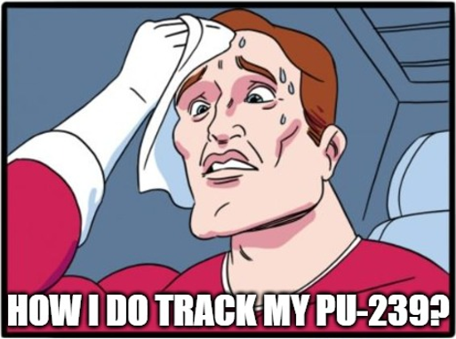
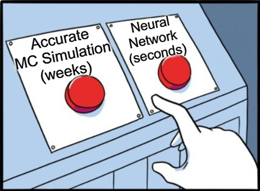

# Nuclear_Depletion_With_ML

Machine-learning surrogates for OpenMC fuel-depletion calculations. A Monte-Carlo
depletion run of a PWR pin cell takes hours to weeks; a trained surrogate
reproduces the isotope trajectories in seconds.

<p align="center">
    <!--
  -->
</p>

Two surrogates are implemented and compared:

- a **DNN** learning the one-step map `c(t) → Δc(t)`, and
- a **Neural ODE** learning the continuous-time generator `dy/dt = A(u, y)·y`,
  where `A` is constrained to the physically allowed transitions of the
  breeding chain, so the learned matrix is directly interpretable.

The target physics is the U238 breeding chain,
`U238 → U239 → Np239 → Pu239 → Pu240 → Pu241 → Pu242`, spanning timescales from
23 minutes to years. `docs/training_pipeline.md` describes both models end to
end; `docs/config_reference.md` documents every configuration key.

## Quickstart

Requires [uv](https://docs.astral.sh/uv/). Python itself is provisioned by uv — you do
not need to install or `module load` anything.

### Train / evaluate a surrogate (no OpenMC, no nuclear data)

```bash
git clone https://github.com/FedericoSaitta/Nuclear_Transport_With_ML.git
cd Nuclear_Transport_With_ML
uv sync --extra ml
uv run nucml --config configs/main_config.yaml
```

Override any config key from the command line:

```bash
uv run nucml --config configs/main_config.yaml runtime.model=DNN train.num_epochs=5
```

Training reads the HDF5 named by `dataset.path_to_data`, which is not in the
repository — put it in `datasets/` (see [Downloading data](#downloading-data)).

### Run a trained model on new data

Every training run writes a **model bundle** beside its outputs, at
`results/<model_name>/model-bundle/`. It holds the weights, the fitted scalers
as plain JSON, the fully-resolved config, the train/val/test split and the git
SHA, seed and dataset hash — a few hundred kB, and no dependency on the training
dataset. Point `nucml` at one:

```bash
uv run nucml --bundle results/matrix_ode_7x7_breeding_chain/model-bundle \
             --data   datasets/new_runs.h5 \
             --out    predictions/
```

That is the whole command. Weights alone would not be enough — both models build
their architecture from the config, and for a NODE the solver and its tolerances
change the numbers, not just the runtime — but the bundle carries all of it, and
`--bundle` wires it up. It also repoints the config's paths at the bundle's own
files, so a bundle copied off a cluster works unmodified.

Overrides still apply on top:

```bash
uv run nucml --bundle <dir> --data new_runs.h5 runtime.device=cuda
```

The scalers are not optional. A checkpoint without them is half a model, so
inference loads them from the bundle and there is no fallback — re-fitting on
whatever data is to hand would silently change every number the run produces.

### Redraw a finished run's figures

`--regenerate-plots` replays a run rather than evaluating new data: the run's own
test split, weights and scalers, so the figures come out the same as the ones the
bundle was published with. Nothing is trained and no checkpoint is written.

```bash
uv run nucml --bundle results/matrix_ode_7x7_breeding_chain/model-bundle \
             --regenerate-plots \
             --data datasets/casl_3305_runs_inter.h5 \
             --out  figures/
```

This one *does* need the training dataset, because the test split is a share of
it — `dataset.split` in the config decides how large a share, and the bundle's
`split_indices.json` records exactly which runs. The rebuilt split is checked
against that record and the run stops on a mismatch, so redrawn figures are
either the published run's or nothing.

For a checkpoint trained before bundles existed, backfill one once on a machine
that still has the dataset:

```bash
uv run nucml-package --ckpt <old.ckpt> --config <its_config.yaml> \
                     --data datasets/casl_3305_runs_inter.h5 --out bundles/legacy
```

Its scalers are *refitted* rather than original, which `metadata.json` records —
a backfilled bundle is a regression anchor, not a reproduction of the run.

### Repository layout

```
configs/          run configs. Every path inside one is relative to the config
                  file itself, so a run is independent of the working directory
src/nuclear_surrogates/
    main.py       the `nucml` entry point: merge config + CLI overrides, dispatch
    datamodule/   HDF5 -> scaled tensors; DNN pair-wise and NODE trajectory splits
    models/       DNN, Neural ODE (incl. the constrained depletion matrix), modes
    utils/        metrics, plotting, path resolution, SQLite experiment logger
data_generation/  OpenMC depletion pipelines (separate environment; no ML imports)
util/             one-off data and depletion-chain tools
scripts/          bootstrap, OpenMC build, SLURM job scripts
tests/            golden regression tests + fixtures; OpenMC install smoke tests
notebooks/        exploration and learning-journey scripts, not library code
docs/             config_reference.md   every config key, with valid values
                  training_pipeline.md  how both models are trained and evaluated

datasets/         training HDF5 files          (untracked)
data/             OpenMC nuclear data, 7 GB    (untracked)
results/          <model_name>/ per run: figures, checkpoints  (untracked)
```

### Generate data with OpenMC (Linux / WSL2 / macOS)

OpenMC is a compiled C++ code and is **not on PyPI**, so it lives in a second
environment and is built from source:

```bash
sudo apt install -y g++ cmake libhdf5-dev        # or `module load gcc cmake hdf5`
UV_PROJECT_ENVIRONMENT=.venv-sim uv sync --extra sim
./scripts/install_openmc.sh                       # builds OpenMC v0.15.2

UV_PROJECT_ENVIRONMENT=.venv-sim uv run python data_generation/datagen.py -n 4 -c 16
```

#### On a Windows laptop: use WSL2

There is no Windows build path for OpenMC — conda-forge and the Docker images
are Linux-only too, and Docker Desktop runs them inside WSL2 regardless. So the
two halves split across the two OSes, sharing one checkout:

| | runs where | environment |
|---|---|---|
| Training (`src/nuclear_surrogates/**`) | Windows, on the GPU | `.venv` |
| Datagen (`data_generation/**`) | WSL2 Ubuntu | `.venv-sim` |

WSL sees the repo at `/mnt/c/...`, so datagen output and `data/` are shared with
Windows — no copying between the halves. A venv is **not** portable across the
boundary, though: `.venv` has `Scripts\python.exe` and is unusable from Linux,
which is why each side runs its own `uv`.

Keep the two terminals in their lanes. `--extra sim` in PowerShell does not fail
loudly — it syncs sim packages into the ML `.venv` and then dies on
`ModuleNotFoundError: No module named 'openmc'`, because there is no Windows
OpenMC to find. Recover with `uv sync --extra ml`. Note also that `uv run` picks
its own environment: activating `.venv\Scripts\Activate.ps1` first is unnecessary
and only creates a way for the two to disagree.

One-time setup, from a PowerShell prompt:

```bash
wsl
sudo apt update && sudo apt install -y g++ cmake libhdf5-dev git
curl -LsSf https://astral.sh/uv/install.sh | sh && source ~/.bashrc

cd /mnt/c/Users/<you>/path/to/Nuclear_Transport_With_ML
echo 'export UV_PROJECT_ENVIRONMENT=$HOME/venvs/nuc-sim' >> ~/.bashrc
source ~/.bashrc
uv sync --extra sim
OPENMC_SRC=$HOME/openmc-src OPENMC_TARGET_VENV=$HOME/venvs/nuc-sim \
    ./scripts/install_openmc.sh
```

**Keep both the venv and the OpenMC build on ext4, not under `/mnt/c`.** uv's
cache lives in the Linux home, so a venv on the Windows drive is a different
filesystem: uv cannot hardlink into it and falls back to copying ~30k files over
the 9p bridge. That is slow and, worse, it can fail *silently* partway — leaving
packages with their `.dist-info` written but no payload. uv then reads that
metadata, believes the package is installed, and never repairs it. The symptom is
a `ModuleNotFoundError: No module named 'numpy'` that survives any number of
`uv sync` runs. Watch for this warning; it means the venv is in the wrong place:

```
warning: Failed to hardlink files; falling back to full copy.
```

Nothing is lost by moving the venv out of the tree — a venv is not portable
across the WSL boundary anyway (`.venv` holds `Scripts\python.exe`). Only the
repo and `data/` need to be shared, and `data/` is fine on `/mnt/c` because it is
read once at worker startup rather than hammered.

Smoke-test before anything long, then every later session is just two commands:

```bash
uv run --extra sim python data_generation/datagen.py -n 1 -c 1     # smoke test
uv run --extra sim python data_generation/datagen.py -n 8 -c 3     # real run
```

Pass `--extra sim` every time. `uv run` re-syncs the environment first, and
without the flag it syncs to the *default* dependency set — quietly uninstalling
scipy, lxml, endf and the rest of the sim extra.

#### `uv sync` uninstalls OpenMC — `uv run` does not

OpenMC is not in `uv.lock` (it is not on PyPI), so a plain `uv sync` treats it as
extraneous and prunes it:

```
Uninstalled 1 package in 12ms
 - openmc==0.15.2 (from file:///home/fedes/openmc-src)
```

`uv run --extra sim` does **not** do this, so the day-to-day datagen commands and
the SLURM scripts are safe. The trap is re-running `uv sync` against an already
built sim environment. Two ways out:

```bash
uv sync --extra sim --locked --inexact     # leave unmanaged packages alone
uv sync --extra sim --locked && ./scripts/install_openmc.sh   # or reinstall after
```

`scripts/bootstrap.sh` and the CI `simulation` job already use the second form by
construction — they sync first, then build. Reach for `--inexact` when syncing an
environment that already has OpenMC in it.

WSL persists across reboots, so the apt packages, `.venv-sim` and the OpenMC
build all survive. Rebuild only when bumping `OPENMC_VERSION`; re-run `uv sync`
only when `pyproject.toml` / `uv.lock` change (it is idempotent and cheap).

**Sizing.** Every datagen worker is a separate process holding its own in-memory
nuclide data, so cores are not the binding constraint — RAM is. On a 16-thread /
16 GB laptop, start at `-c 2` and keep `-c × -t` at 12 or below. WSL2 also claims
~50% of host RAM by default; set `memory=12GB` in `%USERPROFILE%\.wslconfig` to
make that explicit.

Nuclear data (7 GB cross sections + 30 MB depletion chains) is a separate download from
<https://openmc.org/official-data-libraries/> and belongs in `data/`.

### Tests

```bash
uv run --extra ml pytest                                  # ML env: OpenMC tests are not collected
UV_PROJECT_ENVIRONMENT=.venv-sim uv run --extra sim pytest -m openmc
```

Pass the extra: a bare `uv run pytest` syncs the *default* dependency set, which has
no torch, and collection fails on the first import.


## Downloading data

Two different things live in two different places, and only the first is needed to
train:

- **Training datasets** (`datasets/*.h5`) — the output of the OpenMC pipeline,
  produced by `data_generation/` and combined with `util/combine_data.py` +
  `util/csv_to_hdf5.py`. Not redistributed with the repo.
- **Nuclear data** (`data/`) — cross sections (7 GB) and depletion chains (30 MB)
  from <https://openmc.org/official-data-libraries/>, needed only for data
  generation. The cross-section download is an `.xml` file plus three folders
  (`neutron/`, `photon/`, `wmp/`); each depletion chain is a single `.xml`.

## Everyday commands

| Task | Command |
|---|---|
| Set up ML env | `uv sync --extra ml` |
| Set up sim env | `UV_PROJECT_ENVIRONMENT=.venv-sim uv sync --extra sim` then `./scripts/install_openmc.sh` |
| Set up sim env on Windows | inside `wsl`, see [On a Windows laptop](#on-a-windows-laptop-use-wsl2) |
| Train | `uv run nucml --config configs/main_config.yaml` |
| Train with overrides | `uv run nucml --config configs/main_config.yaml train.num_epochs=5 runtime.device=cpu` |
| Run a trained model | `uv run nucml --bundle results/<name>/model-bundle --data <file.h5> --out predictions/` |
| Redraw a run's figures | `uv run nucml --bundle results/<name>/model-bundle --regenerate-plots --data <training.h5> --out figures/` |
| Bundle an old checkpoint | `uv run nucml-package --ckpt <ckpt> --config <cfg> --data <h5> --out bundles/<name>` |
| Run datagen | `UV_PROJECT_ENVIRONMENT=.venv-sim uv run python data_generation/datagen.py -n 4 -c 16` |
| Add an ML dependency | `uv add --optional ml <pkg>` (updates `pyproject.toml` **and** `uv.lock`) |
| Add a sim dependency | `uv add --optional sim <pkg>` |
| Refresh the lock | `uv lock` |
| Check the lock is current | `uv lock --check` |
| Reproduce exactly | `uv sync --extra ml --locked` (fails if the lock drifted) |
| Export for a `pip`-only machine | `uv export --extra ml --no-hashes -o requirements-ml.txt` |

Bump `UV_PROJECT_ENVIRONMENT=.venv-sim` into your shell profile (or a direnv `.envrc`) if you
find yourself doing datagen work for a whole session.

**PowerShell equivalent** of the env-var prefix:

```powershell
$env:UV_PROJECT_ENVIRONMENT = ".venv-sim"; uv sync --extra sim
$env:UV_PROJECT_ENVIRONMENT = $null      # back to .venv
```

(This only helps for `uv sync` bookkeeping on Windows — the OpenMC build and
`datagen.py` itself still have to run inside WSL.)

## Line endings

`.gitattributes` pins `*.sh` to LF and `*.ps1` to CRLF. Windows clones default to
`core.autocrlf=true`, which would otherwise rewrite the shell scripts on checkout
and make bash fail with `$'\r': command not found` under WSL and on the cluster.
Nothing to configure — but if you have a clone predating that file, run
`git add --renormalize .` once.

## Acknowledgements

Computational resources were provided by CSF3 at the University of Manchester.

We thank Dr. Stuart Christie for supervision and guidance during the development
of this work.